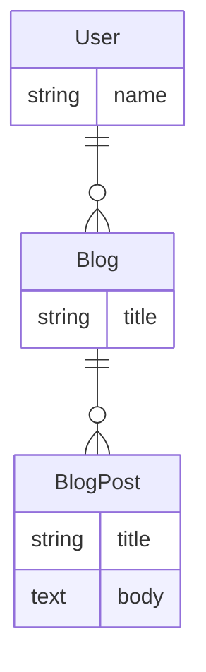
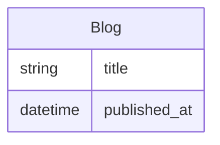

# User Interface

Rhino provides a set of components that are used to construct a default interface for your application and can be used to build a custom user interface for your application. These components are designed to be used with [React](https://react.dev/), [Reactstrap](https://reactstrap.github.io/) and [React Table](https://tanstack.com/table/v8/) along with the [View Controllers](../reference/front_end/controllers) to provide a complete user interface.

## Models and Attributes

In the frontend, models represent backend [resources](resources) and each model has attributes which represent properties in the backend.

Attributes for a model are read from the OpenAPI description and come with a set of additional information to help define the attribute for instance a number may have a minimum and a maximum range. The basis of these additional pieces of information is the OpenAPI data types specification however Rhino provides extensions to the OpenAPI specification in order to provide more detailed information.

For instance if the resources are defined as follows:



The a portion of the OpenAPI description for the `blog_post` model may look like the following:

```javascript
{
  "openapi": "3.0.3",
  "components": {
    "schemas": {
      // highlight-next-line
      // Mapped to a frontend model
      "blog_post": {
        // highlight-next-line
        // Rhino specific extensions for models
        "x-rhino-model": {
          "model": "blog_post",
          "modelPlural": "blog_posts",
          "name": "blogPost",
          "pluralName": "blogPosts",
          "readableName": "Blog post",
          "pluralReadableName": "Blog posts",
          "ownedBy": "blog",
          "singular": false,
          "path": "/api/blog_posts",
          "searchable": false
        },
        "type": "object",
        "properties": {
          // highlight-next-line
          // Mapped to a frontend attribute for blog post - this one is read only
          "id": {
            // highlight-next-line
            // Rhino specific extensions for attributes
            "x-rhino-attribute": {
              "name": "id",
              "readableName": "Id",
              "readable": true,
              "creatable": false,
              "updatable": false
            },
            "readOnly": true,
            "nullable": false,
            "type": "identifier"
          },
         // highlight-next-line
         // Mapped to a frontend attribute for blog post
          "title": {
            "x-rhino-attribute": {
              "name": "title",
              "readableName": "Title",
              "readable": true,
              "creatable": true,
              "updatable": true
            },
            "nullable": false,
            "type": "string"
          },
          // highlight-next-line
          // Mapped to a frontend attribute for blog post
          "body": {
            "x-rhino-attribute": {
              "name": "body",
              "readableName": "Body",
              "readable": true,
              "creatable": true,
              "updatable": true
            },
            "nullable": false,
            "type": "text"
          }
        }
      }
    }
  }
}
```

### Types and formats

An attribute type is based on the OpenAPI data types https://swagger.io/docs/specification/data-models/data-types/ and may include format modifiers, this information is typically used to determine how to render the attribute in the frontend in various contexts such as a form or a table.

## Paths

Paths are used to determine what to display and in which order in components such as forms and tables. Paths are array of strings and [valid react components](https://react.dev/reference/react/isValidElement) or **function that returns such an array**. Strings and react components can be mixed in the same array.

```javascript
const rhinoConfig = {
  version: 1,
  components: {
    blog: {
      ModelIndexTable: {
        props: {
          paths: ["title", "body", <MyCustomComponent />],
        },
      },
    },
  },
};
```

:::info
This is demonstrating setting paths for `ModelIndexTable` for the `blog` model using the [Global Overrides](#global-overrides) feature.
:::

### Strings

An attribute can be referenced starting from a particular model using a string path. For instance if the base model is `Blog`, path is `title`.



A path may lead through multiple models (via references) before ultimately coming to the final attribute for example blog post may have a reference attribute blog and blog may have a reference attribute user. The path to the user name from the `BlogPost` model would then be `blog.user.name`.


```javascript
const rhinoConfig = {
  version: 1,
  components: {
    blog_post: {
      ModelIndexTable: {
        props: {
          paths: ["title", "blog.user.name"],
        },
      },
    },
  },
};
```

### Elements

An element path is a react component that will be rendered in a component like a table or a form. It can be used to display a modified instance of a built-in component or a completely custom component.

```javascript
const rhinoConfig = {
  version: 1,
  components: {
    blog_post: {
      ModelIndexTable: {
        props: {
          paths: [<ModelCellLink path="title" />, <FullyCustomCell />],
        },
      },
    },
  },
};
```

### Roles

If the paths are passed as an object, the keys of the object will be used to specify paths based on the user's roles for the current base owner.

For example, if it was desired to show different fields for the `admin` and `editor` roles:

```javascript
const rhinoConfig = {
  version: 1,
  components: {
    blog: {
      ModelIndexTable: {
        props: {
          paths: {
            admin: ["title", "category", "published_at", "author"],
            editor: ["title", "author"],
          },
        },
      },
    },
  },
};
```

### Paths functions

If the paths are passed as a function, it will receive as arguments the current user's roles and the resources in context. For instance, `paths` related to `create` would receive `null` as `resource`, whereas the `edit` case would lead to `resource` being the current record. For `index`, the list of resources would be passed.

For example, if it was desired to hide some fields from non-admin users:

```javascript
const rhinoConfig = {
  version: 1,
  components: {
    blog: {
      ModelIndexTable: {
        props: {
          paths: (roles, resource) => {
            if (roles.includes("admin")) {
              return ["title", "category", "published_at", "author"];
            }
            return [["title", "author"]];
          },
        },
      },
    },
  },
};
```

It's also possible to show/hide fields based on the resource state:

```javascript
const rhinoConfig = {
  version: 1,
  components: {
    blog: {
      ModelIndexTable: {
        props: {
          paths: (roles, resource) => {
            if (resource.published_at != null) {
              return ["title", "category", "author"];
            }
            return ["title", "category", "published_at", "author"];
          },
        },
      },
    },
  },
};
```

## Component Types

There are several broad categories of components that work in specific ways and can be used in different contexts.

### Global Components

These are components that can be configured globally (including per model and per attribute) with [overrides](#overrides). `ModelIndexTable` is an example of a global component.

### Base Components

These are the implementation of global components. They are useful for composing more specific components or avoiding global overrides. `ModelIndexTableBase` is an example of a base component.

### Simple Components

These are components that provide the context but no user interface. They are useful for creating arbitrary user interfaces while retaining the power of the view controllers. `ModelIndexSimple` is an example of a simple component.

### Abstract Components

These are components that render a more specific component based on the model and attribute data. `ModelCell` is an example of an abstract component.

### Composite Components

These are components that layout or groups multiple components together, typically the components they compose are [overridable](#overrides). `FilterLayoutVertical` is an example of a composite component that lays out filters with a vertical form label and a filter field.

### Convenience Components

Provides common overrides scenarios via `useMergedOverrides` to merge the overrides for the composed component with the overrides for the convenience component. `FieldGroupPassword` is an example of a convenience component, with the same overrides API as FieldGroup

## Overrides

Overrides are a system that allow developers to customize the UI of Rhino. Overrides provide the ability to:

- Alter the props of a component
- Wrap an existing component
- Replacing a component
- Remove a component from the UI

Overrides are based on [Overrides Sample Library](https://github.com/tlrobinson/overrides) and
[Better Reusable React Components with the Overrides Pattern](https://dschnurr.medium.com/better-reusable-react-components-with-the-overrides-pattern-9eca2339f646)

Both global and local overrides are configured using the same API. The primary difference is that global overrides are configured in `src/rhino.config.js` and local overrides are configured as a prop to the component.

### Global Overrides

Global overrides are configured in `src/rhino.config.js` and can be applied to all instances of the component or to a specific model or attribute. For example removing the table footer from all index pages can be done for all models:

```javascript title="src/rhino.config.js"
const rhinoConfig = {
  version: 1,
  components: {
    ModelFooter: null,
  },
};
```

just for a specific model:

```javascript title="src/rhino.config.js"
const rhinoConfig = {
  version: 1,
  components: {
    ModelFooter: null,
  },
};
```

or just for a specific attribute:

```javascript title="src/rhino.config.js"
const rhinoConfig = {
  version: 1,
  components: {
    blog: {
      title: {
        ModelFooter: null,
      },
    },
  },
};
```

### Local Overrides

Local overrides are configured as a prop to a component:

```javascript
const overrides = {
  ModelIndexActions: null,
};

const MyComponent = () => {
  // Do not show the actions for this view
  // highlight-next-line
  return <ModelIndex overrides={overrides} />;
};
```

### Altering props

Props can be altered by using the `props` key of the overrides. Named props will replace existing props, but other props will be preserved.This can be done both globally:

```javascript title="src/rhino.config.js"
const rhinoConfig = {
  version: 1,
  components: {
    blog: {
      ModelSort: {
        props: { paths: ["title", "created_at"] },
      },
    },
  },
};
```

and locally:

```javascript
const overrides = {
  ModelIndexHeader: {
    ModelSort: {
      props: { paths: ["title", "created_at"] },
    },
  },
};

const MyComponent = () => {
  // Specify
  // highlight-next-line
  return <ModelIndex overrides={overrides} />;
};
```

### Wrapping a component

An existing component can be wrapped by using the shorthand syntax or `component` key of the overrides. Globally this can be done as follows:

```javascript title="src/rhino.config.js"
const rhinoConfig = {
  version: 1,
  components: {
    blog: {
      ModelIndex: (props) => (
        <div style={{ backgroundColor: "red" }}>
          // highlight-next-line
          <ModelIndexBase {...props} />
        </div>
      ),
      ModelEdit: {
        component: (props) => (
          <div style={{ backgroundColor: "red" }}>
            // highlight-next-line
            <ModelEditBase {...props} />
          </div>
        ),
      },
    },
  },
};
```

:::warning
Do not wrap the global version of the component as this could lead to an infinite loop with the overrides, always use the base component.
:::

Locally there is really no need to use overrides for this, simply wrap the component:

```javascript
const MyIndexComponent = () => {
  <div style={{ backgroundColor: "red" }}>
    <ModelIndexBase {...props} />
  </div>;
};
```

### Replacing a component

A component can be replaced in the interface with either the shorthand or the `component` key of the overrides. Globally this can be done as follows:

```javascript title="src/rhino.config.js"
const rhinoConfig = {
  version: 1,
  components: {
    blog: {
      // Shorthand
      ModelSort: MyCustomSort,
      // Component key
      ModelPager: { component: MyCustomPager },
    },
  },
};
```

and locally:

```javascript
const overrides = {
  ModelIndexHeader: {
    ModelSort: MyCustomSort,
    ModelPager: { component: MyCustomPager },
  },
};

const MyComponent = () => {
  // Customize the sort and pager components
  return <ModelIndex overrides={overrides} />;
};
```

### Removing a component

A component can be removed from the interface by setting it to null with either the shorthand or the `component` key of the overrides. Globally this can be done as follows:

```javascript title="src/rhino.config.js"
const rhinoConfig = {
  version: 1,
  components: {
    blog: {
      // Shorthand
      ModelSort: null,
      // Component key
      ModelPager: { component: null },
    },
  },
};
```

and locally:

```javascript
const overrides = {
  ModelIndexHeader: {
    ModelSort: null,
    ModelPager: { component: null },
  },
};

const MyComponent = () => {
  // Remove the sort and pager components
  return <ModelIndex overrides={overrides} />;
};
```

## Read more

- [A sample library](https://github.com/tlrobinson/overrides)
- [Better Reusable React Components with the Overrides Pattern](https://dschnurr.medium.com/better-reusable-react-components-with-the-overrides-pattern-9eca2339f646)
