# Table and Cells

`ModelIndexTable` uses `ModelCell` to determine the default renderer of the attribute. `ModelCell` will use the attribute information to determin the specific `ModelCell` component to use and that model cell component will use a basic cell component for rendering. For example, if the attribute is a `string` type, `ModelCell` will use `ModelCellString` to render the cell or if the attribute is an `enum`, `ModelCell` will use `ModelCellEnum` to render the cell. `ModelCellEnum` will use `CellBadge`.

:::info
Not all model cell components have a directly corresponding cell component. For example, `ModelCellArray` does not have a corresponding `CellArray` component. In those cases passing a path only to a cell is unlikely to provide the desired result as there is likely more complex data access required to render the cell.
:::

The complete list of cell components is below.

```mermaid
graph TB
    ModelCell-->ModelCellArray
    ModelCellArray-->CellString
    ModelCell-->ModelCellArrayReference
    ModelCellArrayReference-->CellString
    ModelCell-->ModelCellAttachment
    ModelCellAttachment-->CellLink
    ModelCell-->ModelCellAttachmentDownload
    ModelCellAttachmentDownload-->CellLink
    ModelCell-->ModelCellAttachmentImage
    ModelCellAttachmentImage-->CellImage
    ModelCell-->ModelCellAttachments
    ModelCellAttachments-->CellString
    ModelCell-->ModelCellBoolean
    ModelCellBoolean-->CellBoolean
    ModelCell-->ModelCellCountry
    ModelCellCountry-->CellCountry
    ModelCell-->ModelCellCurrency
    ModelCellCurrency-->CellCurrency
    ModelCell-->ModelCellDate
    ModelCellDate-->CellDate
    ModelCell-->ModelCellDateTime
    ModelCellDateTime-->CellDateTime
    ModelCell-->ModelCellEnum
    ModelCellEnum-->CellBadge
    ModelCell-->ModelCellFloat
    ModelCellFloat-->CellFloat
    ModelCell-->ModelCellInteger
    ModelCellInteger-->CellInteger
    ModelCell-->ModelCellReference
    ModelCellReference-->CellString
    ModelCell-->ModelCellString
    ModelCellString-->CellString
    ModelCell-->ModelCellTime
    ModelCellTime-->CellTime
```



Besides the general configuration options for the cell components, each cell component has its own configuration options.

## ModelCellAttachment

Attachment cells are rendered as a link to the attachment using the `display_name` (usually the file name) or passed children for display.

### Change link text

```jsx title="src/models/overrides.js"
const globalOverrides = {
  blog: {
    index: {
      ModelIndexTable: {
        props: {
          paths: [
            <ModelCellAttachment path="banner_attachment">
              <em>Summary</em>
            </ModelCellAttachment>,
          ],
        },
      },
    },
  },
};
```

## ModelCellAttachmentDownload

Attachment download cells are rendered as a link to the attachment with a download disposition using the `display_name` (usually the file name) or passed children for display.

### Change link text

```jsx title="src/models/overrides.js"
const globalOverrides = {
  blog: {
    index: {
      ModelIndexTable: {
        props: {
          paths: [
            <ModelCellAttachmentDownload path="banner_attachment">
              <em>Summary</em>
            </ModelCellAttachmentDownload>,
          ],
        },
      },
    },
  },
};
```

## ModelCellAttachmentImage

Attachment link cells are rendered as a thumbnail image (usually the file name) or passed children for display. The `altText` prop is used for the `alt` attribute of the image and is by default the `url` of the attachment.

### Change alt text

```jsx title="src/models/overrides.js"
const globalOverrides = {
  blog: {
    index: {
      ModelIndexTable: {
        props: {
          paths: [
            <ModelCellAttachmentImage
              altText="Blog banner"
              path="banner_attachment"
            />,
          ],
        },
      },
    },
  },
};
```

## ModelCellBoolean

Boolean cells are rendered as strings with the text "Yes" or "No" depending on the value of the attribute. The text can be changed by passing the `trueText` and `falseText` props to the `ModelCellBoolean` or CellBoolean components.

### Change text for true and false

```jsx title="src/models/overrides.js"
const globalOverrides = {
  blog: {
    index: {
      ModelIndexTable: {
        props: {
          paths: [
            <ModelCellBoolean
              trueText="Thumbs up"
              falseText="Thumbs down"
              path="published"
            />,
          ],
        },
      },
    },
  },
};
```

## ModelCellDate

Date cells are rendered as strings with a format of `MMMM d, yyyy` (date-fns) by default.

### Change date format to Feb 26/23

```jsx title="src/models/overrides.js"
const globalOverrides = {
  blog: {
    index: {
      ModelIndexTable: {
        props: {
          paths: [<ModelCellDate format="MMM d/yy" path="created_at" />],
        },
      },
    },
  },
};
```

## ModelCellDateTime

Date time cells are rendered as strings with a format of `MMMM d, yyyy h:mm aa` (date-fns) by default.

### Change date time to 24 hr format

```jsx title="src/models/overrides.js"
const globalOverrides = {
  blog: {
    index: {
      ModelIndexTable: {
        props: {
          paths: [
            <ModelCellDateTime format="MMMM d, yyyy HH:mm" path="created_at" />,
          ],
        },
      },
    },
  },
};
```

## ModelCellTime

Time cells are rendered as strings with a format of `h:mm aa` (date-fns) by default.

### Change time to 24 hr format

```jsx title="src/models/overrides.js"
const globalOverrides = {
  blog: {
    index: {
      ModelIndexTable: {
        props: {
          paths: [<ModelCellTime format="HH:mm" path="created_at" />],
        },
      },
    },
  },
};
```
