# Table and Cells

`ModelIndexTable` uses `ModelCell` to determine the default renderer of the attribute. `ModelCell` will use the attribute information to determine the specific `ModelCell` component to use and that model cell component will use a basic cell component for rendering. For example, if the attribute is a `string` type, `ModelCell` will use `ModelCellString` to render the cell or if the attribute is an `enum`, `ModelCell` will use `ModelCellEnum` to render the cell. `ModelCellEnum` will use `CellBadge`.

:::info
Not all model cell components have a directly corresponding cell component. For example, `ModelCellArray` does not have a corresponding `CellArray` component. In those cases passing a path only to a cell is unlikely to provide the desired result as there is likely more complex data access required to render the cell.
:::

The complete list of cell components is below.

```mermaid
graph TB
    ModelCell-->ModelCellArray
    ModelCellArray-->CellString
    ModelCell-->ModelCellArrayReference
    ModelCellArrayReference-->CellString
    ModelCell-->ModelCellAttachment
    ModelCellAttachment-->CellLink
    ModelCell-->ModelCellAttachmentDownload
    ModelCellAttachmentDownload-->CellLink
    ModelCell-->ModelCellAttachmentImage
    ModelCellAttachmentImage-->CellImage
    ModelCell-->ModelCellAttachments
    ModelCellAttachments-->CellString
    ModelCell-->ModelCellBoolean
    ModelCellBoolean-->CellBoolean
    ModelCell-->ModelCellCountry
    ModelCellCountry-->CellCountry
    ModelCell-->ModelCellCurrency
    ModelCellCurrency-->CellCurrency
    ModelCell-->ModelCellDate
    ModelCellDate-->CellDate
    ModelCell-->ModelCellDateTime
    ModelCellDateTime-->CellDateTime
    ModelCell-->ModelCellEnum
    ModelCellEnum-->CellBadge
    ModelCell-->ModelCellFloat
    ModelCellFloat-->CellFloat
    ModelCell-->ModelCellIdentifier
    ModelCellIdentifier-->CellLink
    ModelCell-->ModelCellInteger
    ModelCellInteger-->CellInteger
    ModelCell-->ModelCellReference
    ModelCellReference-->CellString
    ModelCell-->ModelCellString
    ModelCellString-->CellString
    ModelCell-->ModelCellTime
    ModelCellTime-->CellTime
```



Besides the general configuration options for the cell components, each cell component has its own configuration options.

## ModelCellAttachment

Attachment cells are rendered as a link to the attachment using the `display_name` (usually the file name) or passed children for display.

### Change link text

```rhinoconfig title="src/rhino.config.js"
ModelCellAttachment: (props) => (<ModelCellAttachmentBase {...props}>Report</ModelCellAttachmentBase>)
```

## ModelCellAttachmentDownload

Attachment download cells are rendered as a link to the attachment with a download disposition using the `display_name` (usually the file name) or passed children for display.

### Change link text

```rhinoconfig title="src/rhino.config.js"
ModelCellAttachmentDownload: (props) => (<ModelCellAttachmentDownloadBase {...props}>Report</ModelCellAttachmentDownloadBase>)
```

## ModelCellAttachmentImage

Attachment link cells are rendered as a thumbnail image (usually the file name) or passed children for display. The `alt` attribute of the image is by default the `url` of the attachment.

### Change alt text

```rhinoconfig title="src/rhino.config.js"
ModelCellAttachmentImage: { props: { alt: "Blog banner" } }
```

## ModelCellBoolean

Boolean cells are rendered as strings with the text "Yes" or "No" depending on the value of the attribute. The text can be changed by passing the `trueText` and `falseText` props to the `ModelCellBoolean` or `CellBoolean` components.

### Change text for true and false

```rhinoconfig title="src/rhino.config.js"
ModelCellBoolean: { props: { trueText: "Thumbs up", falseText: "Thumbs down" } }
```

## ModelCellBooleanIcon

Boolean icon cells are rendered as [bootstrap icons](https://icons.getbootstrap.com/) with "check" or "x" svg icons depending on the value of the attribute. The icon can be changed by passing the `trueIcon` and `falseIcon` props to the `ModelCellBooleanIcon` or `CellBooleanIcon` components.

### Change icon text for any bootstrap icon

```rhinoconfig title="src/rhino.config.js"
ModelCellBooleanIcon: { props: { trueIcon: "check-circle", falseIcon: "x-circle" } }
```

## ModelCellDate

Date cells are rendered as strings with a format of `MMMM d, yyyy` (date-fns) by default.

### Change date format to Feb 26/23

```rhinoconfig title="src/rhino.config.js"
ModelCellDate: { props: { format: 'MMM d/yy' } }
```

## ModelCellDateTime

Date time cells are rendered as strings with a format of `MMMM d, yyyy h:mm aa` (date-fns) by default.

### Change date time to 24 hr format

```rhinoconfig title="src/rhino.config.js"
ModelCellDate: { props: { format: 'MMMM d, yyyy HH:mm' } }
```

## ModelCellDateTimeDistance

Date time distance cells are rendered as the distance between the given dates in words format of `formatDistance()` (date-fns).
Default baseDate is `new Date()`.

### Change baseDate for any date to compare with value

```js
import { sub } from "date-fns";
const twoDaysAgo = sub(new Date(), { days: 2 });
```

```rhinoconfig title="src/rhino.config.js"
ModelCellDateTimeDistance: {
      props: { baseDate: twoDaysAgo }
    }
```

## ModelCellTime

Time cells are rendered as strings with a format of `h:mm aa` (date-fns) by default.

### Change time to 24 hr format

```rhinoconfig title="src/rhino.config.js"
ModelCellDate: { props: { format: 'HH:mm' } }
```

## ModelCellLinkEmail

Email link cells are rendered as a link with a `href="mailto: ..."` and the value of the attribute as the text.

### Change link text

```rhinoconfig title="src/rhino.config.js"
ModelCellLinkEmail: (props) => (<ModelCellLinkEmailBase {...props}>Click here to send email</ModelCellLinkEmailBase>)
```

## ModelCellLinkTelephone

Telephone link cells are rendered as a link with a `href="tel: ..."` and the value of the attribute as the text.

### Change link text

```rhinoconfig title="src/rhino.config.js"
ModelCellLinkTelephone: (props) => (<ModelCellLinkTelephoneBase {...props}>Click here to call</ModelCellLinkTelephoneBase>)
```
