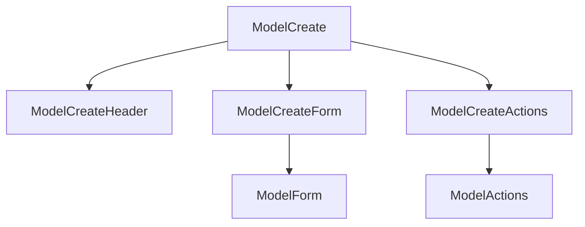

# Create page

The create page is for creating a new record of a model. It is the page that is shown when you click on the "Add" button in the index page. The component structure of the create page is as follows:



## Changing the creatable fields

```javascript
const rhinoConfig = {
  version: 1,
  components: {
    create: {
      ModelCreate: {
        props: {
          paths: ["title", "published_at"],
        },
      },
    },
  },
};
```
