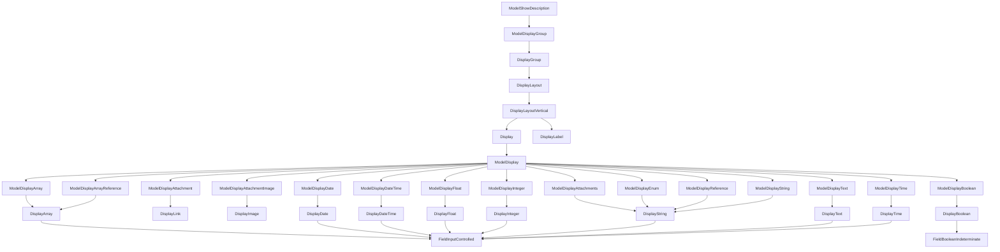

# Displays

Displays render invidual fields in a model on a show page. They are used in the `ModelShowDescription` Dicomponents.

```mermaid
graph TB
    ModelShowDescription-->ModelDisplayGroup

    ModelDisplayGroup-->DisplayGroup
    DisplayGroup-->DisplayLayout

    DisplayLayout-->DisplayLayoutVertical
    DisplayLayoutVertical-->Display
    Display-->ModelDisplay
    DisplayLayoutVertical-->DisplayLabel

    ModelDisplay-->ModelDisplayArray
    ModelDisplayArray-->DisplayArray
    DisplayArray-->FieldInputControlled
    ModelDisplay-->ModelDisplayArrayReference
    ModelDisplayArrayReference-->DisplayArray

    ModelDisplay-->ModelDisplayAttachment
    ModelDisplayAttachment-->DisplayLink

    ModelDisplay-->ModelDisplayAttachmentImage
    ModelDisplayAttachmentImage-->DisplayImage

    ModelDisplay-->ModelDisplayAttachments
    ModelDisplayAttachments-->DisplayString

    ModelDisplay-->ModelDisplayBoolean
    ModelDisplayBoolean-->DisplayBoolean
    DisplayBoolean-->FieldBooleanIndeterminate

    ModelDisplay-->ModelDisplayDate
    ModelDisplayDate-->DisplayDate
    DisplayDate-->FieldInputControlled

    ModelDisplay-->ModelDisplayDateTime
    ModelDisplayDateTime-->DisplayDateTime
    DisplayDateTime-->FieldInputControlled

    ModelDisplay-->ModelDisplayEnum
    ModelDisplayEnum-->DisplayString

    ModelDisplay-->ModelDisplayFloat
    ModelDisplayFloat-->DisplayFloat
    DisplayFloat-->FieldInputControlled

    ModelDisplay-->ModelDisplayInteger
    ModelDisplayInteger-->DisplayInteger
    DisplayInteger-->FieldInputControlled

    ModelDisplay-->ModelDisplayReference
    ModelDisplayReference-->DisplayString

    ModelDisplay-->ModelDisplayString
    ModelDisplayString-->DisplayString
    DisplayString-->FieldInputControlled

    ModelDisplay-->ModelDisplayText
    ModelDisplayText-->DisplayText
    DisplayText-->FieldInputControlled

    ModelDisplay-->ModelDisplayTime
    ModelDisplayTime-->DisplayTime
    DisplayTime-->FieldInputControlled
```
