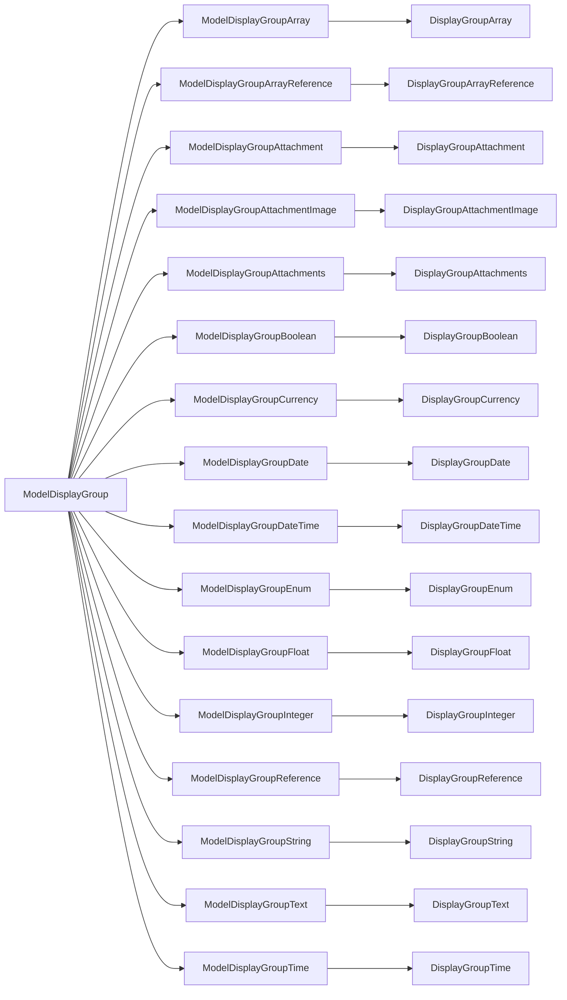

# Displays

Display groups render individual form inputs and labels for a model attribute on the show page. They are used in the `ModelShowDescription` component.

The complete list of display group components is [below](#component-hierarchy).

## Layout

The default layout is vertical. The other layouts are horizontal and floating. Individual fields can be configured to use a different layout by explicitly using the `ModelDisplayGroup` variant ie `<ModelDisplayGroupHorizontal model="blog" path="title"`.

### Global horizontal layout

```rhinoconfig title="src/rhino.config.js"
ModelDisplayGroup: ModelDisplayGroupHorizontal
```

### Global floating layout

```rhinoconfig title="src/rhino.config.js"
ModelDisplayGroup: ModelDisplayGroupFloating
```

## Display behaviour

### Change label

```rhinoconfig title="src/rhino.config.js"
ModelDisplayGroup: { props: { label: 'Awesome Title!' } }
```

### Change enpty placeholder

```rhinoconfig title="src/rhino.config.js"
ModelDisplayGroup: { props: { empty: '/' } }
```

## Component Hierarchy


