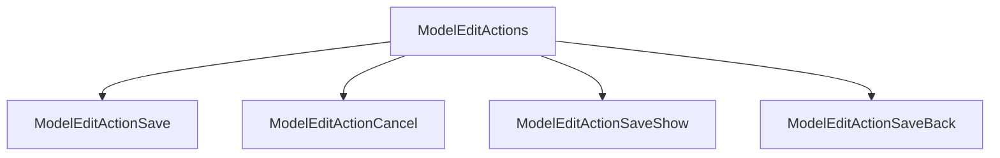

# Actions

The edit page (and modal) actions by default include a save button which saves the resource and returns to the show page of the resource.



## Change the text of the save button

The text of the save button can be changed by passing in a child component.

```rhinoconfig title="src/rhino.config.js" levels=global,model
ModelEditActions: <ModelEditActionsBase overrides={{ModelEditActionSave: <ModelEditActionSave>Keep Forever</ModelEditActionSave>}} />
```

## Change the icon of the save button

The icon of the save button can be changed by passing in an icon name.

```rhinoconfig title="src/rhino.config.js" levels=global,model
ModelEditActions: <ModelEditActionsBase overrides={{ModelEditActionSave: <ModelEditActionSave icon="life-preserver" />}} />
```

## Add a cancel action

A cancel action which returns to the show page can be added:

```rhinoconfig title="src/rhino.config.js" levels=global,model
ModelEditActions: { props: { hasCancel: true } }
```

## Change the text of the cancel button

The text of the cancel button can be changed by passing in a child component.

```rhinoconfig title="src/rhino.config.js" levels=global,model
ModelEditActions: <ModelEditActionsBase overrides={{ModelEditActionCancel: <ModelEditActionCancel>No Way</ModelEditActionCancel>}} hasCancel />
```

## Change the icon of the cancel button

The icon of the cancel button can be changed by passing in an icon name.

```rhinoconfig title="src/rhino.config.js" levels=global,model
ModelEditActions: <ModelEditActionsBase overrides={{ModelEditActionCancel: <ModelEditActionCancel icon="x-octagon" />}} hasCancel />
```

## Replace the default actions

You can replace the default actions with custom actions.

```rhinoconfig title="src/rhino.config.js" levels=global,model
ModelEditActions: { props: { actions: [<MyCustomAction />]} }
```

## Prepend actions

You can prepend one or more actions to the defaults.

```rhinoconfig title="src/rhino.config.js" levels=global,model
ModelEditActions: { props: { prepend: true, actions: [<MyCustomAction />]} }
```

## Append actions

You can append one or more actions to the defaults.

```rhinoconfig title="src/rhino.config.js" levels=global,model
ModelEditActions: { props: { append: true, actions: [<MyCustomAction />]} }
```

## Remove all actions

You can append one or more actions to the defaults.

```rhinoconfig title="src/rhino.config.js" levels=global,model
ModelEditActions: null
```
