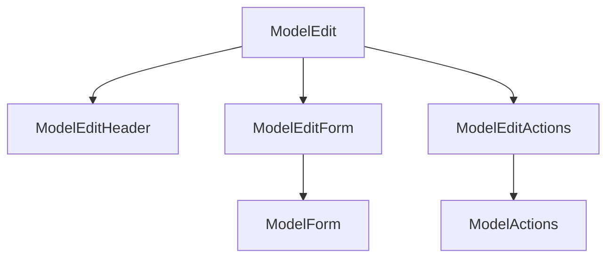

# Edit page

The edit page is for editing a single record of a model. It is the page that is shown when you click on the "Edit" button in the show page. The component structure of the edit page is as follows:



## ModelEditForm

### Changing the editable fields

```javascript
const globalOverrides = {
  blog: {
    edit: {
      ModelEditForm: {
        props: {
          paths: ["title", "published_at"],
        },
      },
    },
  },
};
```
