# Fields

Fields render individual form inputs for a model on the edit and create pages. They are used in the `ModelEditForm` and `ModelCreateForm` components.

The complete list of field components is below.

```mermaid
graph TB
    ModelField-->ModelArrayInteger
    ModelArrayInteger-->Typeahead
    ModelField-->ModelArrayString
    ModelArrayString-->Typeahead

    ModelField-->ModelFieldBoolean
    ModelFieldBoolean-->FieldBoolean

    ModelField-->ModelFieldCountry
    ModelFieldCountry

    ModelField-->ModelFieldCurrency
    ModelFieldCurrency-->CurrencyFormat

    ModelField-->ModelFieldDate
    ModelFieldDate-->FieldDate
    ModelField-->ModelFieldDateTime
    ModelFieldDateTime-->FieldDateTime

    ModelField-->ModelFieldEnum
    ModelFieldEnum-->FieldSelectControlled

    ModelField-->ModelFieldFile

    ModelField-->ModelFieldFloat
    ModelFieldFloat-->FieldFloat
    ModelField-->ModelFieldInteger
    ModelFieldInteger-->FieldInteger
    ModelField-->ModelFieldIntegerSelect

    ModelField-->ModelFieldJoinSimple
    ModelFieldJoinSimple-->Typeahead

    ModelField-->ModelFieldNested
    ModelFieldNested-->ModelField

    ModelField-->ModelFieldPhone
    ModelFieldPhone-->FieldPhone

    ModelField-->ModelFieldReference
    ModelFieldReference-->Typeahead

    ModelField-->ModelFieldString
    ModelFieldString-->FieldInput
    ModelField-->ModelFieldText
    ModelFieldText-->FieldText

    ModelField-->ModelFieldTime
    ModelFieldTime-->FieldTime
    ModelField-->ModelFieldYear
    ModelFieldYear-->FieldYear
```



## General field behaviour

### Change field label

```rhinoconfig title="src/rhino.config.js"
ModelFieldLabel: { props: { label: 'Awesome Title!' } }
```

### Make field read-only

```rhinoconfig title="src/rhino.config.js"
ModelFieldString: { props: { readOnly: true } }
```

## ModelFieldString

### Change placeholder

```rhinoconfig title="src/rhino.config.js"
ModelFieldString: { props: { placeholder: 'Please enter title...' } }
```
