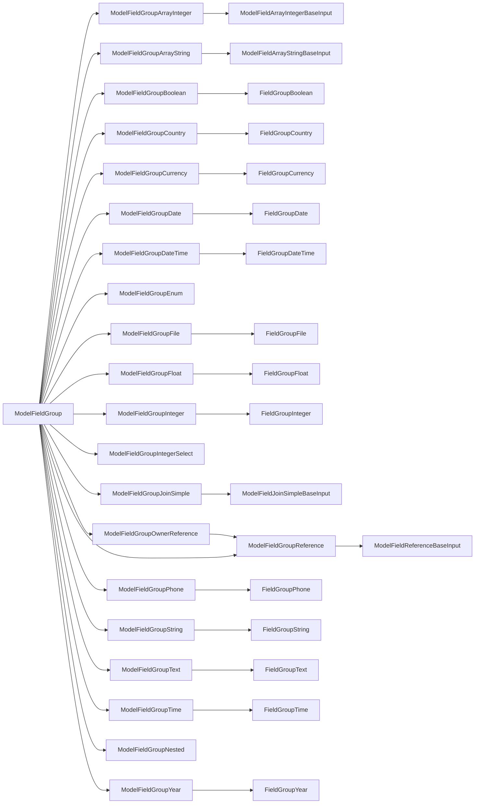

# Field Groups

Field groups render individual form inputs, labels and a feedback component for a model attribute on the edit and create pages. They are used in the `ModelEditForm` and `ModelCreateForm` components.

The complete list of field group components is [below](#component-hierarchy).

## Layout

The default layout is vertical. The other layouts are horizontal and floating. Individual fields can be configured to use a different layout by explicitly using the `ModelFieldGroup` variant ie `<ModelFieldGroupHorizontal model="blog" path="title"`.

### Global horizontal layout

```rhinoconfig title="src/rhino.config.js"
ModelFieldGroup: ModelFieldGroupHorizontal
```

### Global floating layout

```rhinoconfig title="src/rhino.config.js"
ModelFieldGroup: ModelFieldGroupFloating
```

## Field behaviour

### Change label

```rhinoconfig title="src/rhino.config.js"
ModelFieldGroup: { props: { label: 'Awesome Title!' } }
```

### Set read-only

```rhinoconfig title="src/rhino.config.js"
ModelFieldGroup: { props: { readOnly: true } }
```

### Change placeholder

```rhinoconfig title="src/rhino.config.js"
ModelFieldGroup: { props: { placeholder: 'Please enter title...' } }
```

## Component Hierarchy


