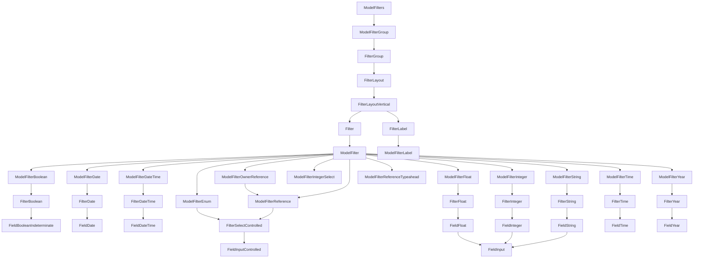

# Filters

The index page is for listing all the records of a model. It is the default page for a model. It is also the page that is shown when you click on the model name in the sidebar. The component structure of the index page is as follows:



## Samples

```jsx
import { useWatch } from "react-hook-form";
import FilterGroup from "rhino/components/forms/FilterGroup";
import ModelFilterGroup from "rhino/components/models/ModelFilterGroup";

const MyDivComponent = () => {
  const watch = useWatch({ name: "created_at.gteq" });

  return <div>Val: {watch}</div>;
};

const globalOverrides = {
  blog: {
    index: {
      ModelIndexHeader: {
        ModelFilters: {
          props: {
            paths: [
              "published_at",
              <MyDivComponent />,
              <ModelFilterGroup
                path="created_at::gteq"
                overrides={{
                  FilterLayout: {
                    FilterLabel: { props: { label: "Created At2" } },
                  },
                }}
              />,
              <FilterGroup
                label="Non-Model Filter"
                placeholder="Customer Placeholder"
                path="title"
              />,
            ],
          },
        },
      },
    },
  },
  blog_post: {
    index: {
      ModelIndexHeader: {
        ModelFilters: {
          props: {
            paths: ["published"],
          },
        },
      },
    },
  },
  every_field: {
    index: {
      ModelIndexHeader: {
        ModelFilters: {
          props: {
            paths: [
              "integer_no_nil::gt",
              "date_time_required::lteq",
              "date_time_required::gt",
              "date_time",
              "date_required::gteq",
              "time_required::lt",
              "year::lt",
              "enum",
            ],
          },
        },
      },
    },
  },
};
```
