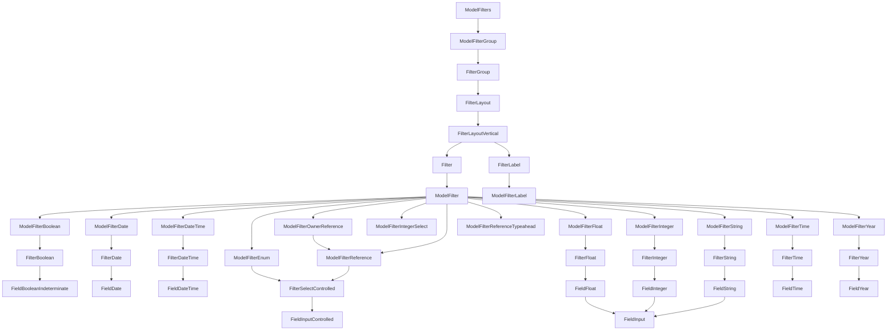

# Filters and Sorting

The index page is for listing all the records of a model. It is the default page for a model. It is also the page that is shown when you click on the model name in the sidebar. The component structure of the index page is as follows:



## Filtering

### Changing default filters

The default filters are what the UI will revert to when the user clears all filters. By default the data is filtered by base owner. You can change the default filters by overriding the `ModelIndex` component (which passes the filter to the [useModelIndexController](../../reference/front_end/controllers#usemodelindexcontroller))

```rhinoconfig title="src/rhino.config.js" levels=global,model
ModelIndex: { props: { defaultFilter: { published: true } } }
```

:::tip

The base owner filters are included by default to limit the query to the current user or organization - if you want to disable them set `defaultFiltersBaseOwner` 

```rhinoconfig title="src/rhino.config.js" levels=global,model
ModelIndex: { props: { defaultFiltersBaseOwner: false, defaultFilter: { published: true } } }
```

:::

### Changing filters and displayed order

List the specific filters in the desired order:

```rhinoconfig title="src/rhino.config.js" levels=global,model
ModelFilters: { props: { paths: ['created_at', 'published_at', 'category'] } }
```

### Changing filter label

Filter labels default to ModelFilterLabel. To change the label of a particular column, you can override for the particular attribute.

```jsx title="src/rhino.config.js" levels=global,model
const rhinoConfig = {
  version: 1,
  components: {
    blog: {
      created_at: {
        ModelFilterLabel: () => "Created",
      },
    },
  },
};
```

### Adding an operator

An filter operator can be added to a filter by adding the operator to the filter path:

```rhinoconfig title="src/rhino.config.js" levels=global,model
ModelFilters: { props: { paths: ['created_at::gteq']}}
```

See [operators](../../concepts/rest_api/filtering.mdx) for a complete list of operators.

## Sorting

### Changing the default sort order

```rhinoconfig title="src/rhino.config.js" levels=global,model
ModelIndex: { props: { defaultOrder: 'created_at' }}
```

### Changing the sortable columns

```rhinoconfig title="src/rhino.config.js" model=blog_post levels=global,model
ModelIndexTable: { props: { sortPaths: ['blog.title'] }}
```

## Pagination

### Changing the default page size

```rhinoconfig title="src/rhino.config.js" levels=global,model
ModelIndex: { props: { defaultLimit: 20 }}
```
