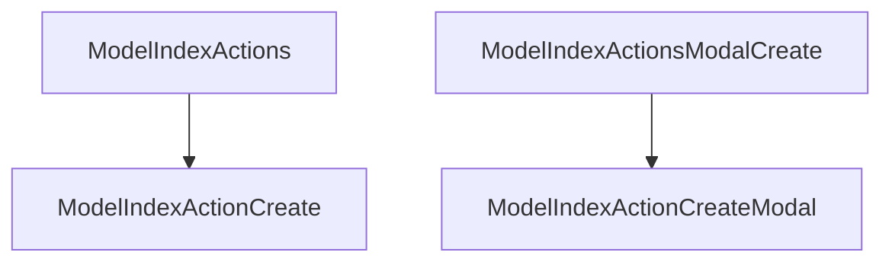

# Actions

The index page actions by default is simply the create action which transfers to the create page. You can add or alter actions on the index page by manipulating the `ModelIndexActions` component.



## Change the text of the create button

The text of the create button can be changed by passing in a child component.

```rhinoconfig title="src/rhino.config.js" levels=global,model
ModelIndexActions: <ModelIndexActionsBase overrides={{ ModelIndexActionCreate: (<ModelIndexActionCreate>New Blog</ModelIndexActionCreate>)}} />
```

## Change the icon of the create button

The icon of the create button can be changed by passing in an icon name.

```rhinoconfig title="src/rhino.config.js" levels=global,model
ModelIndexActions: <ModelIndexActionsBase overrides={{ ModelIndexActionCreate: (<ModelIndexActionCreate icon="plus-circle"/>)}} />
```

## Replace the default action

You can replace the default action with custom actions.

```rhinoconfig title="src/rhino.config.js" levels=global,model
ModelIndexActions: { props: { actions: [<MyCustomAction />]} }
```

## Prepend actions

You can prepend one or more actions to the defaults.

```rhinoconfig title="src/rhino.config.js" levels=global,model
ModelIndexActions: { props: { prepend: true, actions: [<MyCustomAction />]} }
```

## Append actions

You can append one or more actions to the defaults.

```rhinoconfig title="src/rhino.config.js" levels=global,model
ModelIndexActions: { props: { append: true, actions: [<MyCustomAction />]} }
```

## Remove all actions

You can append one or more actions to the defaults.

```rhinoconfig title="src/rhino.config.js" levels=global,model
ModelIndexActions: null
```

## Create with a modal

Instead of creating on a separate page, you can create with a modal.

```rhinoconfig title="src/rhino.config.js" levels=global,model
ModelIndexActions: ModelIndexActionsModalCreate
```
