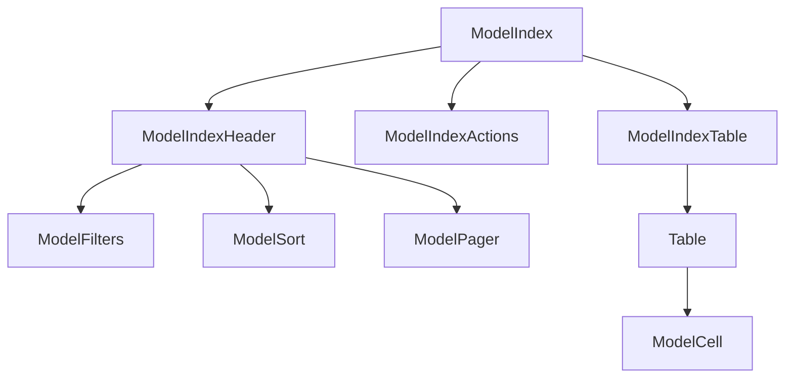

# Index page

The index page is for listing all the records of a model. It is the default page for a model. It is also the page that is shown when you click on the model name in the sidebar. The component structure of the index page is as follows:



## ModelIndexTable

The `paths` prop of the `ModelIndexTable` component is used to specify which attributes of the model should be displayed in the table. `ModelIndexTable` uses `ModelCell` to determine the default renderer of the attribute.

For more about the `ModelCell` component, see the [cells guide](cells).

### Changing attributes and order displayed

List the specific cells in the desired order:

```jsx title="src/rhino.config.js"
const rhinoConfig = {
  version: 1,
  components: {
    blog: {
      ModelIndexTable: {
        props: {
          paths: ["title", "banner_attachment"],
        },
      },
    },
  },
};
```

### Changing a column header

Column headers default to `ModelHeader`. To change the header of a particular column, you can override for the particular attribute.

```jsx title="src/rhino.config.js"
const rhinoConfig = {
  version: 1,
  components: {
    blog: {
      title: {
        ModelHeader: () => "Summary",
      },
    },
  },
};
```

alternatively use the `header` prop of the `ModelCell` component as either a string or a component

```jsx title="src/rhino.config.js"
const rhinoConfig = {
  version: 1,
  components: {
    blog: {
      ModelIndexTable: {
        props: {
          paths: [
            <ModelCell path="title" header="Summary" />,
            <ModelCell path="banner_attachment" header={<em>Banner</em>} />,
          ],
        },
      },
    },
  },
};
```

### Changing a column footer

Column footers default to `ModelFoot`. To change the footer of a particular column, you can override for the particular attribute.

```jsx title="src/rhino.config.js"
const rhinoConfig = {
  version: 1,
  components: {
    blog: {
      title: {
        ModelFooter: () => "Summary",
      },
    },
  },
};
```

alternatively use the `footer` prop of the `ModelCell` component as either a string or a component

```jsx title="src/rhino.config.js"
const rhinoConfig = {
  version: 1,
  components: {
    blog: {
      ModelIndexTable: {
        props: {
          paths: [
            <ModelCell path="title" footer="Summary" />,
            <ModelCell path="banner_attachment" footer={<em>Banner</em>} />,
          ],
        },
      },
    },
  },
};
```

### Removing the header

```rhinoconfig title="src/rhino.config.js"
ModelHeader: null,
```

### Removing the footer

```rhinoconfig title="src/rhino.config.js"
ModelFooter: null,
```

### Custom accessor

You can use a custom accessor to alter the value displayed in a column. The accessor will be passed the `row` from `react-table`. You can also achieve similar results by using a fully custom cell.

```jsx title="src/rhino.config.js"
const rhinoConfig = {
  version: 1,
  components: {
    blog: {
      ModelIndexTable: {
        props: {
          paths: [
            <ModelCell
              path="title"
              accessor={(row) => `${row.title} ${row.published_at}`}
            />,
          ],
        },
      },
    },
  },
};
```

### Fully custom cell

A custom cell to render any arbitrary component. The cell will be passed the `row` and `column` from `react-table` and act as a [`Display Column`](https://tanstack.com/table/v8/docs/guide/column-defs#api).

```jsx title="src/rhino.config.js"
const rhinoConfig = {
  version: 1,
  components: {
    blog: {
      ModelIndexTable: {
        props: {
          paths: [<CustomTitleCell />, "banner_attachment"],
        },
      },
    },
  },
};
```

the header and footer of a custom cell can be overridden with the `header` and `footer` props as either a string or a component:

```jsx title="src/rhino.config.js"
const rhinoConfig = {
  version: 1,
  components: {
    blog: {
      ModelIndexTable: {
        props: {
          paths: [
            <CustomCell header="Custom Header" footer="Custom Footer" />,
            <AnotherCell
              header={<em>Banner Header</em>}
              footer={<em>Banner Footer</em>}
            />,
            "banner_attachment",
          ],
        },
      },
    },
  },
};
```

### Cards instead of a table

Rhino has a `ModelIndexCardGrid` component that can be used to show the records in a card-based view. To use it, add the following to your `overrides.js` file:

```jsx title="src/rhino.config.js"
import ModelIndexCardGrid from "components/models/ModelIndexCardGrid";

const rhinoConfig = {
  version: 1,
  components: {
    blog: {
      ModelIndexTable: ModelIndexCardGrid,
    },
  },
};
```

The rendering of model paths is done by cells so editable cells can be used in the card view as well.

#### Changing the card attributes

```jsx title="src/rhino.config.js"
import ModelIndexCardGrid from "components/models/ModelIndexCardGrid";

const rhinoConfig = {
  version: 1,
  components: {
    blog: {
      ModelIndexTable: {
        component: ModelIndexCardGrid,
        props: {
          paths: ["title", "category", "published_at"],
        },
      },
    },
  },
};
```

#### Skipping title or subtitle on the card

The first two paths are the title and subtitle of the card. If you want to skip the title or subtitle, you can use the `NullComponent` from Rhino.

```jsx title="src/rhino.config.js"
import ModelIndexCardGrid from "components/models/ModelIndexCardGrid";
import { NullComponent } from "rhino/components/null";

const rhinoConfig = {
  version: 1,
  components: {
    blog: {
      ModelIndexTable: {
        component: ModelIndexCardGrid,
        props: {
          paths: [<NullComponent />, <NullComponent />, "published_at"],
        },
      },
    },
  },
};
```
