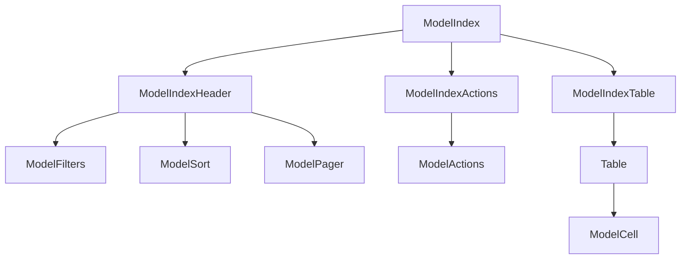

# Index page

The index page is for listing all the records of a model. It is the default page for a model. It is also the page that is shown when you click on the model name in the sidebar. The component structure of the index page is as follows:



## ModelIndexTable

The `paths` prop of the `ModelIndexTable` component is used to specify which attributes of the model should be displayed. The `paths` prop can be a mixed array of strings and [valid react components](https://react.dev/reference/react/isValidElement). The strings should be a [path to the attribute](../../concepts/models_attributes_paths). `ModelIndexTable` uses `ModelCell` to determine the default renderer of the attribute.

For more about the `ModelCell` component, see the [cells guide](cells).

### Changing attributes and order displayed

```jsx title="src/models/overrides.js"
const globalOverrides = {
  blog: {
    index: {
      ModelIndexTable: {
        props: {
          paths: ["title", "banner_attachment"],
        },
      },
    },
  },
};
```

### Changing the column header

```jsx title="src/models/overrides.js"
const globalOverrides = {
  blog: {
    index: {
      ModelIndexTable: {
        props: {
          paths: [<ModelCell header="Summary" path="title" >, "banner_attachment"],
        },
      },
    },
  },
};
```

the header can also be a react component

```jsx title="src/models/overrides.js"
const globalOverrides = {
  blog: {
    index: {
      ModelIndexTable: {
        props: {
          paths: [<ModelCell header={<em>Summary</em>} path="title" >, "banner_attachment"],
        },
      },
    },
  },
};
```

### Changing the column footer

```jsx title="src/models/overrides.js"
const globalOverrides = {
  blog: {
    index: {
      ModelIndexTable: {
        props: {
          paths: [<ModelCell footer="Summary" path="title" >, "banner_attachment"],
        },
      },
    },
  },
};
```

the header can also be a react component

```jsx title="src/models/overrides.js"
const globalOverrides = {
  blog: {
    index: {
      ModelIndexTable: {
        props: {
          paths: [<ModelCell footer={<em>Summary</em>} path="title" >, "banner_attachment"],
        },
      },
    },
  },
};
```

### Removing the header

```jsx title="src/rhino.config.js"
const rhinoConfig = {
  version: 1,
  components: {
    ModelHeader: null,
  },
};
```

### Removing the footer

```jsx title="src/rhino.config.js"
const rhinoConfig = {
  version: 1,
  components: {
    ModelFooter: null,
  },
};
```

### Custom accessor

```jsx
const globalOverrides = {
  blog: {
    index: {
      ModelIndexTable: {
        props: {
          paths: [
            <CustomNameCell
              accessor={(row) => `${row.firstName} ${row.lastName}`}
            />,
          ],
        },
      },
    },
  },
};
```

### Fully custom cell

```jsx
const globalOverrides = {
  blog: {
    index: {
      ModelIndexTable: {
        props: {
          paths: [<CustomCell />],
        },
      },
    },
  },
};
```

### Cards instead of a table

Rhino has a `ModelIndexCard` component that can be used to show the records in a card-based view. To use it, add the following to your `overrides.js` file:

```javascript
import ModelIndexCard from "components/models/ModelIndexCard";

const globalOverrides = {
  blog: {
    index: {
      ModelIndexTable: ModelIndexCard,
    },
  },
};
```

#### Changing the card attributes

```javascript
import ModelIndexCard from "components/models/ModelIndexCard";

const globalOverrides = {
  blog: {
    index: {
      ModelIndexTable: {
        component: ModelIndexCard,
        props: {
          paths: ["title", "category", "published_at"],
        },
      },
    },
  },
};
```
