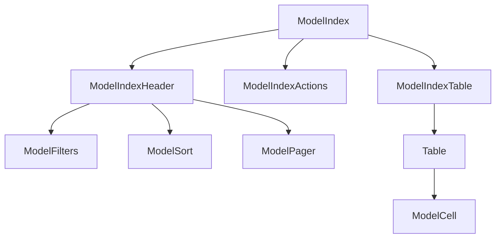

# Index page

The index page is for listing all the records of a model. It is the default page for a model. It is also the page that is shown when you click on the model name in the sidebar. The component structure of the index page is as follows:



## ModelIndexTable

The `paths` prop of the `ModelIndexTable` component is used to specify which attributes of the model should be displayed. The `paths` prop can be a mixed array of strings and [valid react components](https://react.dev/reference/react/isValidElement). The strings should be a [path to the attribute](../../concepts/models_attributes_paths). `ModelIndexTable` uses `ModelCell` to determine the default renderer of the attribute.

For more about the `ModelCell` component, see the [cells guide](cells).

### Changing attributes and order displayed

List the specific cells in the desired order:

```jsx title="src/rhino.config.js"
const rhinoConfig = {
  version: 1,
  components: {
    blog: {
      ModelIndexTable: {
        props: {
          paths: ["title", "banner_attachment"],
        },
      },
    },
  },
};
```

### Changing a column header

Column headers default to `ModelHeader`. To change the header of a particular column, you can override for the particular attribute.

```jsx title="src/rhino.config.js"
const rhinoConfig = {
  version: 1,
  components: {
    blog: {
      title: {
        ModelHeader: () => "Summary",
      },
    },
  },
};
```

### Changing a column footer

Column footers default to `ModelFoot`. To change the footer of a particular column, you can override for the particular attribute.

```jsx title="src/rhino.config.js"
const rhinoConfig = {
  version: 1,
  components: {
    blog: {
      title: {
        ModelFooter: () => "Summary",
      },
    },
  },
};
```

### Removing the header

```rhinoconfig title="src/rhino.config.js"
ModelHeader: null,
```

### Removing the footer

```rhinoconfig title="src/rhino.config.js"
ModelFooter: null,
```

### Custom accessor

You can use a custom accessor to alter the value displayed in a column. The accessor will be passed the `row` from `react-table`. You can also achieve similar results by using a fully custom cell.

```jsx title="src/rhino.config.js"
const rhinoConfig = {
  version: 1,
  components: {
    blog: {
      ModelIndexTable: {
        props: {
          paths: [
            <ModelCellString
              path="title"
              accessor={(row) => `${row.title} ${row.published_at}`}
            />,
          ],
        },
      },
    },
  },
};
```

### Fully custom cell

You can use a custom cell to render anything you want. The cell will be passed the `row` and `column` from `react-table` and act as a [`Display Column`](https://tanstack.com/table/v8/docs/guide/column-defs#api).

```jsx title="src/rhino.config.js"
const rhinoConfig = {
  version: 1,
  components: {
    blog: {
      ModelIndexTable: {
        props: {
          paths: [<CustomTitleCell />, "banner_attachment"],
        },
      },
    },
  },
};
```

### Cards instead of a table

Rhino has a `ModelIndexCard` component that can be used to show the records in a card-based view. To use it, add the following to your `overrides.js` file:

```jsx title="src/rhino.config.js"
import ModelIndexCard from "components/models/ModelIndexCard";

const rhinoConfig = {
  version: 1,
  components: {
    blog: {
      ModelIndexTable: ModelIndexCard,
    },
  },
};
```

#### Changing the card attributes

```jsx title="src/rhino.config.js"
import ModelIndexCard from "components/models/ModelIndexCard";

const rhinoConfig = {
  version: 1,
  components: {
    blog: {
      ModelIndexTable: {
        component: ModelIndexCard,
        props: {
          paths: ["title", "category", "published_at"],
        },
      },
    },
  },
};
```
