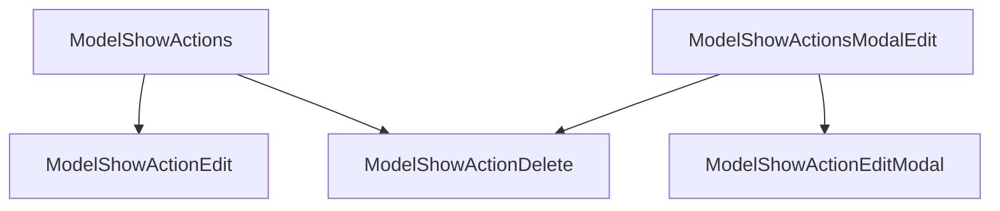

# Actions

The show page actions by default include an edit button which transfers to the edit page and a delete button which prompts the user to delete. You can add or alter actions on the index page by manipulating the `ModelShowActions` component.



## Change the text of the edit button

The text of the edit button can be changed by passing in a child component.

```rhinoconfig title="src/rhino.config.js" levels=global,model
ModelShowActions: <ModelShowActionsBase overrides={{ ModelShowActionEdit: (<ModelShowActionEdit>Change Blog</ModelShowActionEdit>)}} />
```

## Change the icon of the edit button

The icon of the edit button can be changed by passing in an icon name.

```rhinoconfig title="src/rhino.config.js" levels=global,model
ModelShowActions: <ModelShowActionsBase overrides={{ ModelShowActionEdit: <ModelShowActionEdit icon="pen"/>}} />
```

## Change the text of the delete button

The text of the delete button can be changed by passing in a child component.

```rhinoconfig title="src/rhino.config.js" levels=global,model
ModelShowActions: <ModelShowActionsBase overrides={{ ModelShowActionDelete: (<ModelShowActionDelete>Throw Away Blog</ModelShowActionDelete>)}} />
```

## Change the icon of the delete button

The icon of the delete button can be changed by passing in an icon name.

```rhinoconfig title="src/rhino.config.js" levels=global,model
ModelShowActions: <ModelShowActionsBase overrides={{ ModelShowActionDelete: <ModelShowActionDelete icon="trash2" />}} />
```

## Remove the edit button

The edit button can be removed entirely

```rhinoconfig title="src/rhino.config.js" levels=global,model
ModelShowActions: <ModelShowActionsBase overrides={{ ModelShowActionEdit: null}} />
```

## Remove the delete button

The delete button can be removed entirely

```rhinoconfig title="src/rhino.config.js" levels=global,model
ModelShowActions: <ModelShowActionsBase overrides={{ ModelShowActionDelete: null}} />
```

## Replace the default actions

You can replace the default actions with custom actions.

```rhinoconfig title="src/rhino.config.js" levels=global,model
ModelShowActions: { props: { actions: [<MyCustomAction />]} }
```

## Prepend actions

You can prepend one or more actions to the defaults.

```rhinoconfig title="src/rhino.config.js" levels=global,model
ModelShowActions: { props: { prepend: true, actions: [<MyCustomAction />]} }
```

## Append actions

You can append one or more actions to the defaults.

```rhinoconfig title="src/rhino.config.js" levels=global,model
ModelShowActions: { props: { append: true, actions: [<MyCustomAction />]} }
```

## Remove all actions

You can append one or more actions to the defaults.

```rhinoconfig title="src/rhino.config.js" levels=global,model
ModelShowActions: null
```

## Edit with a modal

Instead of editing on a separate page, you can edit with a modal.

```rhinoconfig title="src/rhino.config.js" levels=global,model
ModelShowActions: ModelShowActionsModalEdit
```
