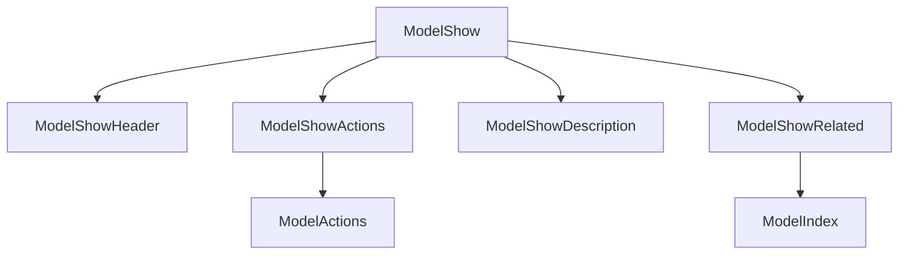

# Show page

The show page is for showing a single record of a model. It is the page that is shown when you click on a record in the index page. The component structure of the show page is as follows:



## Changing displayed fields

```javascript
const rhinoConfig = {
  version: 1,
  components: {
    create: {
      ModelShow: {
        props: {
          paths: ["title", "published_at"],
        },
      },
    },
  },
};
```

## Horizontal layout

```rhinoconfig title="src/rhino.config.js"
ModelDisplayGroup: ModelDisplayGroupHorizontal
```
