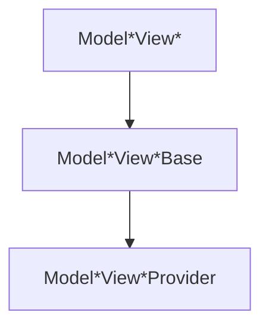

# View Controllers

The `ModelShow`, `ModelIndex`, `ModelCreate` and `ModelEdit` top level view components are driven by view controllers that provide the data to power a React context. These controllers are created with hooks. The basic pattern for the components is:



The `Base` version of the component will take the arguments for the controller as props and pass them to the controller hook. The `Provider` version of the component will take the results of the controller hook and set them as the value for the view `Context`. The context can then be access via a `useModelViewContext` and will provide the results of the controller hook.

```jsx
const MyCustomComponent = () => {
  const { resource } = useModelIndexContext();
  return <div>{resource.name}</div>;
};

<ModelIndexBase defaultFilter={{ category: 6 }}>
  <MyCustomComponent />
</ModelIndexBase>;
```

## useModelShowController

useModelShowController takes an options object for configuration.

```jsx
const { model, resource } = useModelShowController(options);
```

- `model` a string for the model name or an already existing model object (from useModel or getModel) **_(required)_**
- `modelId` a value for the id of the object to fetch (omitted or null for singular models) **_(required)_**
- `paths` the paths to render for the create view (default: all viewable paths except for the parent)
- All options for [useModelShow](api_hooks#usemodelshow)

and in addition to the [useModelShow](api_hooks#usemodelshow) returns, useModelShowController returns:

- `modelId` the id of the model object being fetched
- `renderPaths` the elementized paths for the show view
- `create` the return values of [useModelCreate](api_hooks#usemodelcreate)
- `update` the return values of [useModelUpdate](api_hooks#usemodelupdate)
- `destroy` the return values of [useModelDestroy](api_hooks#usemodeldestroy)

### useModelShowContext

Returns the context for the model show view.

### ModelShowContext

The model show context.

### ModelShowProvider

Injects the results of the model show controller into the context.

## useModelIndexController

useModelIndexController takes an options object for configuration.

```jsx
const { page, resources } = useModelIndexController(options);
```

- `model` a string for the model name or an already existing model object (from useModel or getModel) **_(required)_**
- `syncUrl` a boolean indicating whether to sync the url with the query parameters (default: true)
- `defaultFiltersBaseOwner` a boolean indicating whether to include a filter by the base owner (default: true)
- `defaultFilter` the default filter
- `defaultOrder` the default order
- `defaultLimit` the default limit
- `defaultOffset` the default offset
- `defaultSearch` the default search
- `queryOptions` as per [useModelIndex](api_hooks#usemodelindex)
- `networkOptions` as per [useModelIndex](api_hooks#usemodelindex)

and in addition to the [useModelIndex](api_hooks#usemodelindex) returns, useModelIndex returns:

- `defaultState` the default state of the model index controller - before any URL parameters are applied
- `initialState` the current state of the model index controller - after any URL parameters are applied
- `order` the current order of the resources
- `setOrder` a function to set the order of the resources
- `filter` the current filter of the resources
- `setFilter` a function to set the filter of the resources
- `totalFilters` the total number of dynamic filters
- `fullFilter` the current full filter of the resources (default plus dynamic filters)
- `totalFullFilters` the total number of full filters
- `setDefaultFilter` a function to set the default filter of the resources
- `search` the current search of the resources
- `setSearch` a function to set the search of the resources
- `limit` the current limit of the resources
- `setLimit` a function to set the limit of the resources
- `offset` the current offset of the resources
- `setOffset` a function to set the offset of the resources
- `totalPages` the total number of pages of resources base on current limit
- `page` the current page of the resources
- `setPage` a function to set the page of the resources
- `hasNextPage` a boolean indicating whether there is a next page of resources
- `hasPrevPage` a boolean indicating whether there is a previous page of resources
- `firstPage` a function to set the page to the first page of resources
- `lastPage` a function to set the page to the last page of resources
- `create` the return values of [useModelCreate](api_hooks#usemodelcreate)
- `update` the return values of [useModelUpdate](api_hooks#usemodelupdate)
- `destroy` the return values of [useModelDestroy](api_hooks#usemodeldestroy)

### useModelIndexContext

Returns the context for the model index view.

### ModelIndexContext

The model index context.

### ModelIndexProvider

Injects the results of the model index controller into the context.

## useModelCreateController

useModelCreateController takes an options object for configuration.

```jsx
const {
  mutation,
  showParent: { resource: blog },
} = useModelCreateController(options);
```

- `model` a string for the model name or an already existing model object (from useModel or getModel) **_(required)_**
- `parentId` the id of the parent **_(required)_**
- `disabled` a boolean indicating whether the form elements in the view should be disabled (default: false)
- `extraDefaultValues` values to augment the default values for the create view
- `paths` the paths to render for the create view (default: all creatable paths except for the parent)
- `queryOptions` options to pass to the query for the parent model

and in addition to the [useModelCreate](api_hooks#usemodelcreate) returns, useModelCreateController returns:

- `parentModel` a memoized version of the parent model
- `parentId` the id of the parent model object being fetched
- `resolver` the yup resolver for the model uses for form validation
- `schema` the yup schema for the model uses for form validation
- `methods` the output of `useForm` from react-hook-form
- `showParent` the return values of [useModelShow](api_hooks#usemodelshow) for the parent object

### useModelCreateContext

Returns the context for the model create view.

### ModelCreateContext

The model edit context.

### ModelCreateProvider

Injects the results of the model edit controller into the context.

## useModelEditController

useModelEditController takes an options object for configuration.

```jsx
const {
  mutation,
  show: { resource: blog },
} = useModelEditController(options);
```

- `model` a string for the model name or an already existing model object (from useModel or getModel) **_(required)_**
- `modelId` the id of the resource to be edited **_(required)_**
- `disabled` a boolean indicating whether the form elements in the view should be disabled (default: false)
- `extraDefaultValues` values to augment the default values for the create view
- `debounceDelay` the delay in ms to debounce the mutation (default: 2000)
- `paths` the paths to render for the create view (default: all creatable paths except for the parent)
- `queryOptions` options to pass to the query for the model object (passed to useModelShow)

and in addition to the [useModelUpdate](api_hooks#usemodelupdate) returns, useModelEditController returns:

- `modelId` the id of the model object being fetched
- `resolver` the yup resolver for the model uses for form validation
- `schema` the yup schema for the model uses for form validation
- `methods` the output of `useForm` from react-hook-form
- `debouncedMutate` a debounced mutate function delayed by `debounceDelay`
- `show` the return values of [useModelShow](api_hooks#usemodelshow)

### useModelEditContext

Returns the context for the model edit view.

### ModelEditContext

The model edit context.

### ModelEditProvider

Injects the results of the model edit controller into the context.

## Read more

- [React Hooks](https://react.dev/learn/reusing-logic-with-custom-hooks)
- [Passing Data Deeply with Context](https://react.dev/learn/passing-data-deeply-with-context)
- [How to use React Context effectively](https://kentcdodds.com/blog/how-to-use-react-context-effectively)
