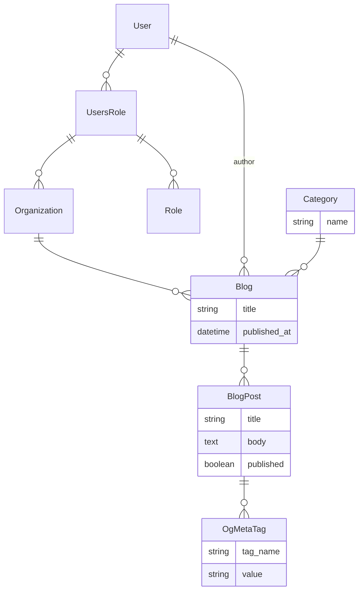

# Tutorial: Organization

This guide will walk you through adding organization support to your application with users and roles.

## Prerequisites

Ensure you have completed the [Tutorial: Advanced](./tutorial_advanced)

## Data Model

The following data model will be used for this tutorial.



Every blog has a category and a series of blog posts.

:::info
The user, users role, role and organization models are provided by Rhino.
:::

Every blog has a category and a series of blog posts. Each blog post can have a series of OpenGraph (og) tags.

## Extend the Data Model

- Creating roles and organizations and update user `rails rhino_organizations:install`

- Update `app/models/blog.rb` as follows

```ruby

class Blog < ApplicationRecord
  belongs_to :organization
  belongs_to :author, default: -> { Rhino::Current.user }, class_name: 'User', foreign_key: :user_id

  belongs_to :category, optional: true
  has_many :blog_posts, dependent: :destroy

  has_one_attached :banner

  rhino_owner_base
  rhino_references %i[author organization category banner_attachment blog_posts]
  rhino_properties_write except: :author
  rhino_search [:title]

  validates :title, presence: true
end


```

- Have blogs owned by the organization

```bash
$ rails g migration add_organization_to_blog organization:references
```

- Use seed data to add organizations
  Add below to `db/seeds.rb`

```ruby
def generate_blogs(user, org)
  5.times do
    blog = Blog.create!(user_id: user.id, organization: org, title: FFaker::Book.unique.author, category_id: Category.ids.sample)
    20.times do
      BlogPost.create!(blog_id: blog.id, title: FFaker::Book.unique.title, body: FFaker::Book.unique.description, published: [true, false].sample)
    end
  end
end

if Rails.env.development?
  AdminUser.destroy_all
  Blog.destroy_all
  User.destroy_all
  Organization.destroy_all
  Role.destroy_all

  AdminUser.create!(email: 'admin@example.com', password: 'password', password_confirmation: 'password')

  user = User.create!(email: 'test@example.com', password: 'password', password_confirmation: 'password')
  user2 = User.create!(email: 'other@example.com', password: 'password', password_confirmation: 'password')

  org = []
  org << Organization.create!(name: "Single User Org")
  org << Organization.create!(name: "Multi User Owner Org")
  org << Organization.create!(name: "Viewer Org")
  org << Organization.create!(name: "Editor Org")
  org << Organization.create!(name: "Author Org")

  role = Role.find_or_create_by!(name: "admin")
  ur = UsersRole.create!(user: user, organization: org[0], role: role)

  role = Role.find_or_create_by!(name: "admin")
  ur = UsersRole.create!(user: user, organization: org[1], role: role)

  role = Role.find_or_create_by!(name: "viewer")
  ur = UsersRole.create!(user: user, organization: org[2], role: role)
  role = Role.find_or_create_by!(name: "admin")
  ur = UsersRole.create!(user: user2, organization: org[2], role: role)

  role = Role.find_or_create_by!(name: "editor")
  ur = UsersRole.create!(user: user, organization: org[3], role: role)
  role = Role.find_or_create_by!(name: "admin")
  ur = UsersRole.create!(user: user2, organization: org[3], role: role)

  role = Role.find_or_create_by!(name: "author")
  ur = UsersRole.create!(user: user, organization: org[4], role: role)
  role = Role.find_or_create_by!(name: "admin")
  ur = UsersRole.create!(user: user2, organization: org[4], role: role)

  3.times do
    Category.create!(name: FFaker::Book.unique.genre)
  end

  org.each do |o|
    generate_blogs(user, o)
  end

  org[2..].each do |o|
    generate_blogs(user2, o)
  end
end
```

- Then reset the database and seed data:

```bash
$ rails db:reset
```

- Add created models to db

```bash
$ rails db:migrate
```

- Run the server to check the results

```bash
$ rails s
```
