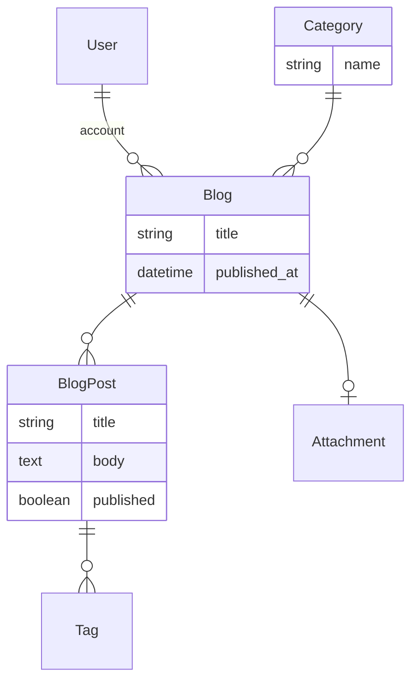

# Search, attachments and tags

```mdx-code-block
import Tabs from '@theme/Tabs';
import TabItem from '@theme/TabItem';
```

This tutorial will walk you through extending the [Tutorial](./) to add more advanced features:

- Search
- File Attachments
- Tags

## Prerequisites

Ensure you have completed the [Tutorial](./).

## Data model

The following data model will be used for this tutorial.



Every blog has a category and a series of blog posts. Each blog has a banner image. Each blog post can have 1 or more tags.

:::info
The user, tags and file attachment models are provided by Rails & Rhino.
:::

## Search

Add search to the Blog model so that the user can search for blogs by title with `rhino_search`.

```ruby title="app/models/blog.rb"
class Blog < ApplicationRecord
  belongs_to :user
  belongs_to :category
  has_many :blog_posts, dependent: :destroy

  # Rhino specific code
  rhino_owner_base
  rhino_references [:user, :category]
  # highlight-next-line
  rhino_search [:title]

  validates :title, presence: true
end
```

You will now have a search box in the UI to search for blogs by title if you refresh the browser.


## File Attachments

Add file to display a banner image for the blog.

```ruby title="app/models/blog.rb"
class Blog < ApplicationRecord
  belongs_to :user
  belongs_to :category
  has_many :blog_posts, dependent: :destroy

  # highlight-next-line
  has_one_attached :banner

  # Rhino specific code
  rhino_owner_base
  # highlight-next-line
  rhino_references [:user, :category, :banner_attachment]
  rhino_search [:title]

  validates :title, presence: true
end
```

:::warning
You must include the `:banner_attachment` in the [rhino_references](/docs/concepts/resources/#references) array to make the file available through the Blog API call.
:::

:::info
`has_one_attached` is from a feature of Rails called [ActiveStorage](https://guides.rubyonrails.org/active_storage_overview.html) that manages file attachments.
:::

You will now be able to upload a file when creating or editing a blog.


## Tags

Add tagging to the BlogPost model so that the user can add tags to blog posts. Install the tagging migrations:

```mdx-code-block
<Tabs>
<TabItem value="Docker">
```

```bash
docker compose run --rm backend "rails acts_as_taggable_on_engine:install:migrations"
docker compose run --rm backend "rails db:migrate"
```

```mdx-code-block
</TabItem>
<TabItem value="Local">
```

```bash
rails acts_as_taggable_on_engine:install:migrations
rails db:migrate
```

```mdx-code-block
</TabItem>
</Tabs>
```

And add tagging to the BlogPost model.

```ruby title="app/models/blog_post.rb"
class BlogPost < ApplicationRecord
  belongs_to :blog

  # highlight-next-line
  acts_as_taggable_on :tags

  # Rhino specific code
  rhino_owner :blog
  rhino_references [:blog]

  validates :title, presence: true
  validates :body, presence: true
end
```

:::info
`acts_as_taggable_on :tags` is from the [acts-as-taggable-on](https://github.com/mbleigh/acts-as-taggable-on) gem that manages tags for ActiveRecord objects.
:::

You will now be able to add one or more tags to a blog post.


