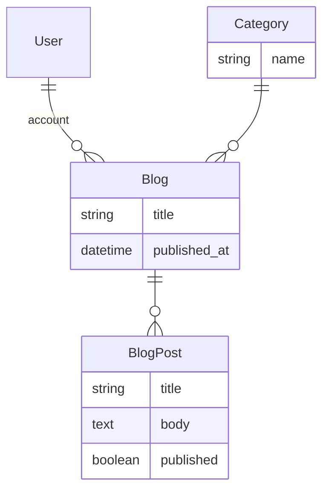

# Tutorial

```mdx-code-block
import Tabs from '@theme/Tabs';
import TabItem from '@theme/TabItem';
```

This tutorial will walk you through creating a blog application.

:::tip
The code for this part of the tutorial can be found in the [Rhino Examples](https://github.com/rhino-project/rhino-project/tree/beta/examples/tutorial)
:::

:::danger Disclaimer:

Rhino was designed to support multi-tenancy by default, which is provided by the organizations module

this tutorial follows without that module, but the tutorial for using the module following the same blog app is provided here as well.

we highly recommend using the organizations module right of-the-bat even if the apps are not multi-tenant to avoid unexpected challenges later on.

:::

## Prerequisites

Ensure you have followed [Getting Started](../getting_started) guide to set up your development environment.

## Data model

The following data model will be used for this tutorial.



Every blog has a category and a series of blog posts

:::info
The user model is provided by Rhino.
:::

## Create the models and database schema

Generate the models and database schema for the application

```mdx-code-block
<Tabs>
<TabItem value="Docker">
```

```bash
docker compose run --rm backend "rails g model category name:string"
docker compose run --rm backend "rails g model blog user:references title:string published_at:datetime category:references"
docker compose run --rm backend "rails g model blog_post blog:references title:string body:text published:boolean"
docker compose run --rm backend "rails db:migrate"
```

```mdx-code-block
</TabItem>
<TabItem value="Local">
```

```bash
rails g model category name:string
rails g model blog user:references title:string published_at:datetime category:references
rails g model blog_post blog:references title:string body:text published:boolean
rails db:migrate
```

```mdx-code-block
</TabItem>
</Tabs>
```

:::info
These are standard rails commands. See the [Rails Guides](https://guides.rubyonrails.org/) for more information.
:::

## Configure the models

Update the model code files to extend the [associations](https://guides.rubyonrails.org/association_basics.html), [validations](https://guides.rubyonrails.org/active_record_validations.html) and Rhino configuration for the model files as highlighted below

### Category

```ruby title="app/models/category.rb"
class Category < ApplicationRecord
  # highlight-next-line
  has_many :blogs, dependent: :destroy

  # Rhino specific code
  # highlight-next-line
  rhino_owner_global

  # highlight-next-line
  validates :name, presence: true
end
```

:::tip
[rhino_owner_global](/docs/concepts/resources/#global-owner) indicates there is no owner for this model. It is a global resource.
:::

### Blog

```ruby title="app/models/blog.rb"
class Blog < ApplicationRecord
  belongs_to :user
  belongs_to :category
  # highlight-next-line
  has_many :blog_posts, dependent: :destroy

  # Rhino specific code
  # highlight-next-line
  rhino_owner_base
  # highlight-next-line
  rhino_references [:user, :category]

  # highlight-next-line
  validates :title, presence: true
end
```

:::tip
[rhino_owner_base](/docs/concepts/resources/#base-owner) assigns the owner of this model to "base owner", which is the User by default in Rhino
:::

:::tip
[rhino_references](/docs/concepts/resources/#references) includes the related models in the API response
:::

### BlogPost

```ruby title="app/models/blog_post.rb"
class BlogPost < ApplicationRecord
  belongs_to :blog

  # Rhino specific code
  # highlight-next-line
  rhino_owner :blog
  # highlight-next-line
  rhino_references [:blog]

  # highlight-next-line
  validates :title, presence: true
  # highlight-next-line
  validates :body, presence: true
end
```

:::tip
[rhino_owner](/docs/concepts/resources/#ownership) sets ownership of this model to another model, in this case the `Blog` model
:::

## Configure the REST API

Update the Rhino configuration so that Blog, BlogPost, are available through the Rest API

```diff title="config/initializers/rhino.rb"
- config.resources += ['User', 'Account']
+ config.resources += ['User', 'Account', 'Blog', 'BlogPost', "Category"]
```

:::warning
If you don't add the models to the `config.resources` array, they will not be available through the API.
:::

## Seed the database

Rhino provides a [per environment way to seed the database](../guides/importing/seeding.mdx). Create a few categories in development to use for blogs (a user was already created in `db/seeds/development/users.rb`).

```ruby title="db/seeds/development/categories.rb"
# Generate sample categories
3.times do
  Category.create!(name: FFaker::Book.unique.genre)
end
```

And add the seed data to the database

```mdx-code-block
<Tabs>
<TabItem value="Docker">
```

```bash
docker compose run --rm backend "rails db:seed"
```

```mdx-code-block
</TabItem>
<TabItem value="Local">
```

```bash
rails db:seed
```

```mdx-code-block
</TabItem>
</Tabs>
```

## Restart the application

```mdx-code-block
<Tabs>
<TabItem value="Docker">
```

```bash
docker compose restart backend
docker compose restart vite
```

```mdx-code-block
</TabItem>
<TabItem value="Local">
```

`Ctrl-C` to stop the backend and

```bash
rails s
```

`Ctrl-C` to stop the frontend and

```bash
npm start
```

```mdx-code-block
</TabItem>
</Tabs>
```

## Create blogs and blog posts

Go to [http://localhost:3000](http://localhost:3000) in your browser and login to the application with `test@example.com` and `password`.


You can now create a new blog and add some blog posts with the automatically generated user interface.


