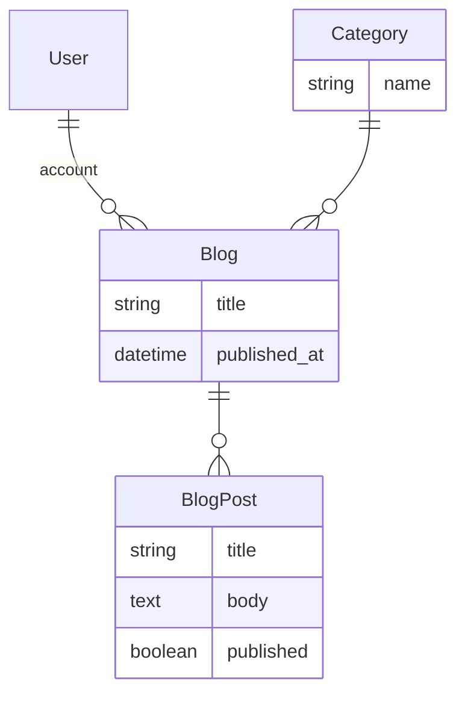

# Tutorial

This tutorial will walk you through creating a blog application.

## Prerequisites

Ensure you have checked out the [boilerplate_mono](https://github.com/nubinary/boilerplate_mono) repo and set up the server [README](https://github.com/nubinary/boilerplate_mono/blob/main/server/README.md) and client [README](https://github.com/nubinary/boilerplate_mono/blob/main/client/README.md)

## Data model

The following data model will be used for this tutorial.



Every blog has a category and a series of blog posts

:::info
The user model is provided by Rhino.
:::

## Create the models and database schema

Generate the models and database schema for the application using the following commands from the `server` directory.

```bash
rails g model category name:string
rails g model blog user:references title:string published_at:datetime category:references
rails g model blog_post blog:references title:string body:text published:boolean
rails db:migrate
```

:::info
These are standard rails commands. See the [Rails Guides](https://guides.rubyonrails.org/) for more information.
:::

## Configure the models

Update the model code files to extend the [associations](https://guides.rubyonrails.org/association_basics.html), [validations](https://guides.rubyonrails.org/active_record_validations.html) and Rhino configuration for the model files as highlighted below

### Category

```ruby title="app/models/category.rb"
class Category < ApplicationRecord
  # highlight-next-line
  has_many :blogs, dependent: :destroy

  # Rhino specific code
  # highlight-next-line
  rhino_owner_global

  # highlight-next-line
  validates :name, presence: true
end
```

:::tip
[rhino_owner_global](/docs/concepts/resources/#global-owner) indicates there is no owner for this model. It is a global resource.
:::

### Blog

```ruby title="app/models/blog.rb"
class Blog < ApplicationRecord
  belongs_to :user
  belongs_to :category
  # highlight-next-line
  has_many :blog_posts, dependent: :destroy

  # Rhino specific code
  # highlight-next-line
  rhino_owner_base
  # highlight-next-line
  rhino_references [:user, :category]

  # highlight-next-line
  validates :title, presence: true
end
```

:::tip
[rhino_owner_base](/docs/concepts/resources/#base-owner) assigns the owner of this model to "base owner", which is the User by default in Rhino
:::

:::tip
[rhino_references](/docs/concepts/resources/#references) includes the related models in the API response
:::

### BlogPost

```ruby title="app/models/blog_post.rb"
class BlogPost < ApplicationRecord
  belongs_to :blog

  # Rhino specific code
  # highlight-next-line
  rhino_owner :blog
  # highlight-next-line
  rhino_references [:blog]

  # highlight-next-line
  validates :title, presence: true
  # highlight-next-line
  validates :body, presence: true
end
```

:::tip
[rhino_owner](/docs/concepts/resources/#ownership) ownership of this model to another model, in this case the `Blog` model, which is the User by default in Rhino
:::

## Configure the REST API

Update the Rhino configuration so that Blog, BlogPost, are available through the Rest API

```diff title="config/initializers/rhino.rb"
- config.resources += ['User', 'Account']
+ config.resources += ['User', 'Account', 'Blog', 'BlogPost', "Category"]
```

:::warning
If you don't add the models to the `config.resources` array, they will not be available through the API.
:::

## Seed the database

Rails provides a way to seed the database with data using the `db/seeds.rb` file. This is useful for testing and development. Create a few categories to use in the blog and a user to login with.

```ruby title="db/seeds/development/users.rb"
# Generate sample admin user
AdminUser.find_or_create_by(email: "admin@example.com") do |u|
  u.password = "password"
end

# Generate sample user
User.find_or_create_by(email: "test@example.com") do |u|
  u.password = "password"
  u.confirmed_at = DateTime.now
end

# Generate sample categories
3.times do
  Category.create!(name: FFaker::Book.unique.genre)
end
```

And add the seed data to the database

```bash
rails db:seed
```

## Restart the application

Run the server and client

From the `server` directory

```bash
rails s
```

From the `client` directory

```bash
npm start
```

## Create blogs and blog posts

Go to [http://localhost:3001](http://localhost:3001) in your browser and login to the application with `test@example.com` and `password`.


You can now create a new blog and add some blog posts with the automatically generated user interface.


