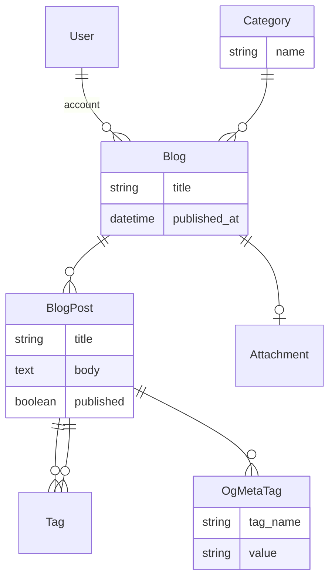

# Using nested resources

```mdx-code-block
import Tabs from '@theme/Tabs';
import TabItem from '@theme/TabItem';
```

This tutorial will walk you through extending the [Search, attachments and tags Tutorial](./advanced) to support nested resources.

## Prerequisites

Ensure you have completed the [Search, attachments and tags Tutorial](./advanced).

## Data model

The following data model will be used for this tutorial.



Each blog post can have 1 or more Open Graph meta tags.

## Create the model and database schema

Generate the models and database schema for the application using the following commands

```mdx-code-block
<Tabs>
<TabItem value="Docker">
```

```bash
docker compose run --rm backend "rails g model og_meta_tag blog_post:references tag_name:string value:string"
docker compose run --rm backend "rails db:migrate"
```

```mdx-code-block
</TabItem>
<TabItem value="Local">
```

```bash
rails g model og_meta_tag blog_post:references tag_name:string value:string
rails db:migrate
```

```mdx-code-block
</TabItem>
</Tabs>
```

## Configure the models

Update the model code files to extend the [associations](https://guides.rubyonrails.org/association_basics.html), [validations](https://guides.rubyonrails.org/active_record_validations.html) and Rhino configuration for the model files as highlighted below

### OgMetaTag

```ruby title="app/models/og_meta_tag.rb"
class OgMetaTag < ApplicationRecord
  belongs_to :blog_post

  # Rhino specific code
  # highlight-next-line
  rhino_owner :blog_post
  # highlight-next-line
  rhino_references %i[blog_post]

  # highlight-next-line
  validates :tag_name, presence: true
  # highlight-next-line
  validates :value, presence: true

  # Rhino specific code
  # highlight-next-line
  def display_name
    # highlight-next-line
    "#{tag_name}: #{value}"
  # highlight-next-line
  end
end
```

:::tip
By default Rhino will use the `name` or `title` attribute of the model, but this can be overridden by defining a `display_name` method.
:::

### BlogPost

```ruby title="app/models/blog_post.rb"
class BlogPost < ApplicationRecord
  belongs_to :blog
  # highlight-next-line
  has_many :og_meta_tags, dependent: :destroy

  # highlight-next-line
  accepts_nested_attributes_for :og_meta_tags, allow_destroy: true

  acts_as_taggable_on :tags

  # Rhino specific code
  rhino_owner :blog
  # highlight-next-line
  rhino_references [:blog, :og_meta_tags]

  validates :title, presence: true
  validates :body, presence: true
end
```

## Configure the REST API

Update the Rhino configuration so that OgMetaTag is available through the Rest API.

```diff title="config/initializers/rhino.rb"
- config.resources += ['User', 'Account', 'Blog', 'BlogPost', "Category"]
+ config.resources += ['User', 'Account', 'Blog', 'BlogPost', "Category", "OgMetaTag"]
```

:::info
[accepts_nested_attributes_for](https://api.rubyonrails.org/classes/ActiveRecord/NestedAttributes/ClassMethods.html#method-i-accepts_nested_attributes_for) is part of Rails and allows for child model attributes to be passed through the parent model.
:::

## Restart the server

```mdx-code-block
<Tabs>
<TabItem value="Docker">
```

```bash
docker compose restart backend
```

```mdx-code-block
</TabItem>
<TabItem value="Local">
```

`Ctrl-C` to stop the backend and

```bash
rails s
```

```mdx-code-block
</TabItem>
</Tabs>
```

## Attach OpenGraph meta tags to a blog post

You will now be able to add one or more OpenGraph meta tags to a blog post, as well as edit and delete them.


