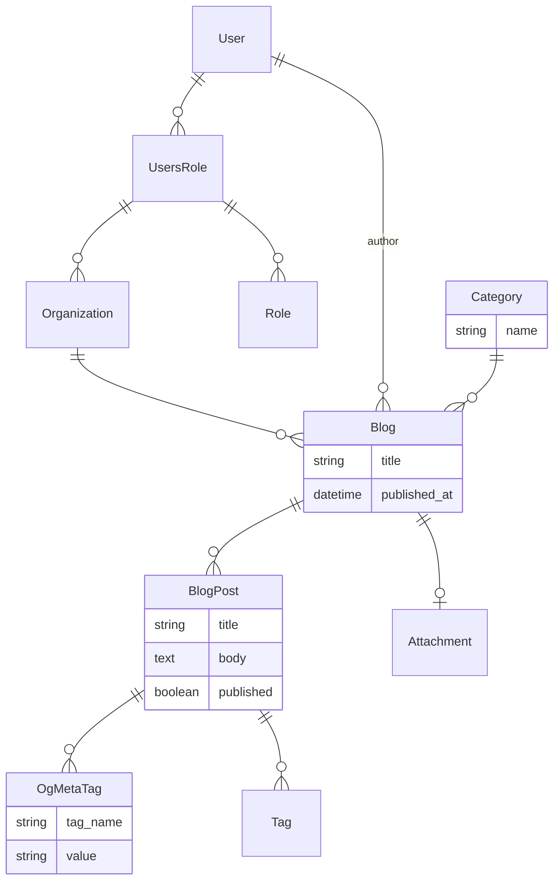

# Adding organizations and roles

```mdx-code-block
import Tabs from '@theme/Tabs';
import TabItem from '@theme/TabItem';
```

This tutorial will walk you through adding organization support to your application with users and roles.

## Prerequisites

Ensure you have completed the [Advanced Features Tutorial](./advanced)

## Data model

The following data model will be used for this tutorial.



Every blog has a category and a series of blog posts. Each blog post can have a series of OpenGraph (og) tags.

:::info
The user, users role, role and organization models are provided by Rhino.
:::

## Install the organizations module

Rhino provides a module to add organization support to your application. Drop the current sample data and install the module with the following commands:

```mdx-code-block
<Tabs>
<TabItem value="Docker">
```

```bash
docker compose run --rm backend "rails db:seed:replant"
docker compose run --rm backend "rails rhino_organizations:install"
```

```mdx-code-block
</TabItem>
<TabItem value="Local">
```

```bash
rails db:seed:replant
rails rhino_organizations:install
```

```mdx-code-block
</TabItem>
</Tabs>
```

:::caution
`rails db:reset` will drop the current database and rebuild it from the schema. This will remove any data you have added to the database. We could write a more complex migration to add the new tables but this is a tutorial and we want to keep it simple.
:::

## Update the data model

Add an organization reference to the blog model with the following commands:

```mdx-code-block
<Tabs>
<TabItem value="Docker">
```

```bash
docker compose run --rm backend "rails g migration add_organization_to_blog organization:references"
```

```mdx-code-block
</TabItem>
<TabItem value="Local">
```

```bash
rails g migration add_organization_to_blog organization:references
```

```mdx-code-block
</TabItem>
</Tabs>
```

Update the Blog model to use the new organization reference and add a new author reference as highlighted below.

```ruby title="app/models/blog.rb"
class Blog < ApplicationRecord
  # highlight-next-line
  belongs_to :organization
  # highlight-next-line
  belongs_to :author, default: -> { Rhino::Current.user }, class_name: 'User', foreign_key: :user_id

  belongs_to :category, optional: true
  has_many :blog_posts, dependent: :destroy

  has_one_attached :banner

  # Rhino specific code
  rhino_owner_base
  # highlight-next-line
  rhino_references [:organization, :author, :category, :banner_attachment]
  # highlight-next-line
  rhino_properties_write except: :author
  rhino_search [:title]

  validates :title, presence: true
end
```

:::info
[`rhino_properties_write`](https://api.rhino-project.org/classes/Rhino/Resource/Properties.html#method-i-rhino_properties_write) restricts which properties of the model are writeable via the API.
:::

:::info
`Rhino::Current.user` provides the authenticated user accessing the API. Here it is used as the default value for the author reference.
:::

and migrate the database

```mdx-code-block
<Tabs>
<TabItem value="Docker">
```

```bash
docker compose run --rm backend "rails db:migrate"
```

```mdx-code-block
</TabItem>
<TabItem value="Local">
```

```bash
rails db:migrate
```

```mdx-code-block
</TabItem>
</Tabs>
```

## Seed the database

Create two users and several organizations along with sample blogs and blog posts for each organization.

```ruby title="db/seeds/development/users.rb"
require_relative "categories"

AdminUser.find_or_create_by(email: "admin@example.com") do |u|
  u.password = "password"
end

# Create two sample users
User.find_or_create_by(email: "test@example.com") do |u|
  u.password = "password"
  u.confirmed_at = DateTime.now
end

User.find_or_create_by(email: "other@example.com") do |u|
  u.password = "password"
  u.confirmed_at = DateTime.now
end
```

```ruby title="db/seeds/development/organizations.rb"
require_relative "users"

user = User.find_by(email: "test@example.com")
user_other = User.find_by(email: "other@example.com")

# Create sample organizations
org = ["Single User Org", "Multi User Org", "Viewer Org", "Editor Org"].map do |name|
  Organization.find_or_create_by!(name:)
end

role_admin = Role.find_or_create_by!(name: "admin")
role_viewer = Role.find_or_create_by!(name: "viewer")
role_editor = Role.find_or_create_by!(name: "editor")

# The test@example.com user is the only user and admin of the "Single User Org" organization
UsersRole.find_or_create_by!(user:, organization: org[0], role: role_admin)

# The test@example.com and other@example.com are both users and admins of the "Multi User Org" organization
UsersRole.find_or_create_by!(user:, organization: org[1], role: role_admin)

# The test@example.com is a viewer and other@example.com is an admin of the "Viewer Org" organization
UsersRole.find_or_create_by!(user:, organization: org[2], role: role_viewer)
UsersRole.find_or_create_by!(user: user_other, organization: org[2], role: role_admin)

# The test@example.com is an editor and other@example.com is an admin of the "Editor Org" organization
UsersRole.find_or_create_by!(user:, organization: org[3], role: role_editor)
UsersRole.find_or_create_by!(user: user_other, organization: org[3], role: role_admin)
```

```ruby title="db/seeds/development/blogs.rb"
require_relative "organizations"

user = User.find_by(email: "test@example.com")
user_other = User.find_by(email: "other@example.com")

# Function to generate sample blogs and blog posts
def generate_blogs(user, org)
  5.times do
    blog = Blog.create!(user_id: user.id, organization: org, title: FFaker::Book.unique.author, category_id: Category.ids.sample)
    20.times do
      BlogPost.create!(blog_id: blog.id, title: FFaker::Book.unique.title, body: FFaker::Book.unique.description, published: [true, false].sample)
    end
  end
end

# Only test@example.com authors blogs in the "Single User Org" organization
org = Organization.find_by(name: "Single User Org")
generate_blogs(user, org)

# Both users author blogs in the "Multi User Org" organization
org = Organization.find_by(name: "Multi User Org")
generate_blogs(user, org)
generate_blogs(user_other, org)

# Only other@example.com authors blogs in the "Viewer Org" organization
org = Organization.find_by(name: "Viewer Org")
generate_blogs(user_other, org)

# Only other@example.com authors blogs in the "Editor Org" organization
org = Organization.find_by(name: "Editor Org")
generate_blogs(user_other, org)
```

And add the seed data to the database

```mdx-code-block
<Tabs>
<TabItem value="Docker">
```

```bash
docker compose run --rm backend "rails db:seed:replant"
```

```mdx-code-block
</TabItem>
<TabItem value="Local">
```

```bash
rails db:seed:replant
```

```mdx-code-block
</TabItem>
</Tabs>
```

## Restart the server

```mdx-code-block
<Tabs>
<TabItem value="Docker">
```

```bash
docker compose restart backend
```

```mdx-code-block
</TabItem>
<TabItem value="Local">
```

`Ctrl-C` to stop the backend and

```bash
rails s
```

```mdx-code-block
</TabItem>
</Tabs>
```

## Explore multiple organizations

Login to the application with `test@example.com` and `password` or `other@example.com` and `password`. All organizations with be accessible with the switcher in the bottom left corner of the screen.


The ability to edit the data in the "Viewer Org" for example is restricted to `other@example.com`:


While `test@example.com` can only look:


