# Adding organizations and roles

This tutorial will walk you through adding organization support to your application with users and roles.

## Prerequisites

Ensure you have completed the [Advanced Features Tutorial](./advanced)

## Data model

The following data model will be used for this tutorial.

```mermaid
erDiagram
    User ||--o{ UsersRole : ""
    UsersRole ||--o{ Organization : ""
    UsersRole ||--o{ Role : ""
    Organization ||--o{ Blog : ""
    User ||--o{ Blog : author
    Blog ||--o{ BlogPost : ""
    Blog ||--o| Attachment : ""
    Blog {
        string title
        datetime published_at
    }
    BlogPost {
        string title
        text body
        boolean published
    }
    Category ||--o{ Blog : ""
    Category {
        string name
    }
    BlogPost ||--o{ OgMetaTag : ""
    BlogPost ||--o{ Tag : ""
    OgMetaTag {
        string tag_name
        string value
    }
```



Every blog has a category and a series of blog posts. Each blog post can have a series of OpenGraph (og) tags.

:::info
The user, users role, role and organization models are provided by Rhino.
:::

## Install the organizations module

Rhino provides a module to add organization support to your application. Drop the current sample data and install the module with the following commands from the `server` directory:

```bash
rails db:reset
rails rhino_organizations:install
```

:::caution
`rails db:reset` will drop the current database and rebuild it from the schema. This will remove any data you have added to the database. We could write a more complex migration to add the new tables but this is a tutorial and we want to keep it simple.
:::

## Update the data model

Add an organization reference to the blog model with the following commands from the `server` directory:

```bash
rails g migration add_organization_to_blog organization:references
rails db:migrate
```

Update the Blog model to use the new organization reference and add a new author reference as highlighted below.

```diff title="app/models/blog.rb"
class Blog < ApplicationRecord
  # highlight-next-line
- belongs_to :user
  # highlight-next-line
+ belongs_to :organization
  # highlight-next-line
+ belongs_to :author, default: -> { Rhino::Current.user }, class_name: 'User', foreign_key: :user_id

  belongs_to :category, optional: true
  has_many :blog_posts, dependent: :destroy

  has_one_attached :banner

  # Rhino specific code
  rhino_owner_base
  # highlight-next-line
- rhino_references [:user, :category, :banner_attachment]
  # highlight-next-line
+ rhino_references [:organization, :author, :category, :banner_attachment]
  # highlight-next-line
+ rhino_properties_write except: :author
  rhino_search [:title]

  validates :title, presence: true
end
```

:::info
[`rhino_properties_write`](https://api.rhino-project.org/classes/Rhino/Resource/Properties.html#method-i-rhino_properties_write) restricts which properties of the model are writeable via the API.
:::

:::info
`Rhino::Current.user` provides the authenticated user accessing the API. Here it is used as the default value for the author reference.
:::

## Seed the database

Create two users and several organizations along with sample to use in the blog and a user to login with.

```ruby title="db/seeds.rb"
# Generate sample categories
3.times do
  Category.create!(name: FFaker::Book.unique.genre)
end

# Function to generate sample blogs and blog posts
def generate_blogs(user, org)
  5.times do
    blog = Blog.create!(user_id: user.id, organization: org, title: FFaker::Book.unique.author, category_id: Category.ids.sample)
    20.times do
      BlogPost.create!(blog_id: blog.id, title: FFaker::Book.unique.title, body: FFaker::Book.unique.description, published: [true, false].sample)
    end
  end
end

# Create two sample users
user = User.create!(email: 'test@example.com', password: 'password', password_confirmation: 'password')
user_other = User.create!(email: 'other@example.com', password: 'password', password_confirmation: 'password')

# Create sample organizations
org = ["Single User Org", "Multi User Org", "Viewer Org", "Editor Org"].map do |name|
  Organization.create!(name:)
end

role_admin = Role.create!(name: "admin")
role_viewer = Role.create!(name: "viewer")
role_editor = Role.create!(name: "editor")

# The test@example.com user is the only user and admin of the "Single User Org" organization
UsersRole.create!(user: user, organization: org[0], role: role_admin)
# Only test@example.com authors blogs in the "MuSinglelti User Org" organization
generate_blogs(user, org[0])

# The test@example.com and other@example.com are both users and admins of the "Multi User Org" organization
UsersRole.create!(user: user, organization: org[1], role: role_admin)
# Both users author blogs in the "Multi User Org" organization
generate_blogs(user, org[1])
generate_blogs(user_other, org[1])

# The test@example.com is a viewer and other@example.com is an admin of the "Viewer Org" organization
UsersRole.create!(user: user, organization: org[2], role: role_viewer)
UsersRole.create!(user: user_other, organization: org[2], role: role_admin)
# Only other@example.com authors blogs in the "Viewer Org" organization
generate_blogs(user_other, org[3])

# The test@example.com is an editor and other@example.com is an admin of the "Editor Org" organization
UsersRole.create!(user: user, organization: org[3], role: role_editor)
UsersRole.create!(user: user_other, organization: org[3], role: role_admin)
# Only other@example.com authors blogs in the "Editor Org" organization
generate_blogs(user_other, org[3])
```

And add the seed data to the database

```bash
rails db:seed
```

## Restart the server

```bash
rails s
```

## Explore multiple organizations

Login to the application with `test@example.com` and `password` or `other@example.com` and `password`. All organizations with be accessible with the switcher in the top right corner of the screen.


The ability to edit the data in the "Viewer Org" for example is restricted to `other@example.com`:


While `test@example.com` can only look:


