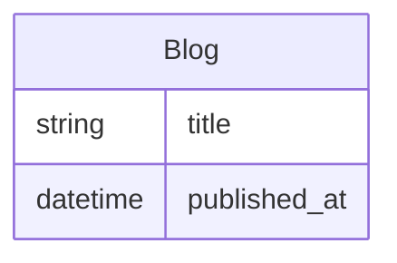
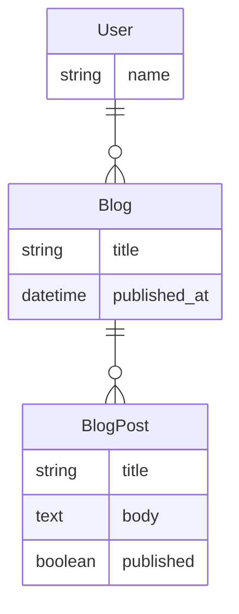

# Models, Attributes and Paths

In the frontend, models represent backend [resources](resources) and each model has attributes which represent properties in the backend.

Attributes for a model are read from the open API come with a set of additional information to help define the attribute for instance a number may have a minimum and a maximum range the basis of these additional pieces of information is the open API data types specification however Rhino provides extensions to the open API specification in order to provide more detailed information

An attribute can be referenced from a base model using a path. For instance if the base model is `Blog`, path is `title`.

A path may lead through multiple models (via references) before ultimately coming to the final attribute for example blog post may have a reference attribute blog and blog may have a reference attribute user. The path to the user name from the `BlogPost` model would then be `blog.user.name`.

Attributes come with a set of additional information. For instance a number may have a minimum and a maximum range. The basis of these additional pieces of information is the open API data types specification however Rhino provides extensions to the open API specification in order to provide more detailed information

## Types and formats

An attribute type is based on the OpenAPI data types https://swagger.io/docs/specification/data-models/data-types/ and may include format modifiers.

### Form fields

The type/format is mapped as follows for form fields:

| Type                         |      Format       |                               Component |
| ---------------------------- | :---------------: | --------------------------------------: |
| identifier                   |       none        |                                    none |
| string                       |       none        |                                   Input |
| string                       |    enum (prop)    |                      ModelFormFieldEnum |
| string                       |       date        |                  ModelFormFieldDatetime |
| string                       |     datetime      |                  ModelFormFieldDatetime |
| string                       |       phone       |                     ModelFormFieldPhone |
| string                       |      country      |                   ModelFormFieldCountry |
| string                       |       time        |                  ModelFormFieldDatetime |
| integer                      |       none        |                   ModelFormFieldInteger |
| integer                      |       year        |                      ModelFormFieldYear |
| decimal (or float or number) |       none        |                     ModelFormFieldFloat |
| decimal (or float or number) |     currency      |                  ModelFormFieldCurrency |
| text                         |       none        |                        Input (textarea) |
| boolean                      |       none        |                  CustomInput (checkbox) |
| array (string)               |       none        |                               Typeahead |
| array (reference)            |       none        | ModelFormFieldArray/ModelNestedManyForm |
| array (reference)            | join_table_simple |                ModelFormFieldJoinSimple |
| reference                    |       none        |                 ModelFormFieldReference |
| reference                    |       file        |                      ModelFormFieldFile |
