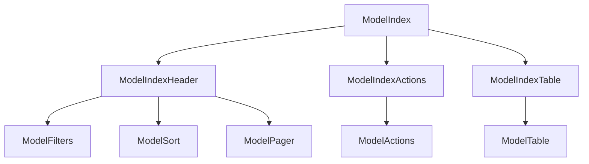

# Index page

The index page is for listing all the records of a model. It is the default page for a model. It is also the page that is shown when you click on the model name in the sidebar. The component structure of the index page is as follows:



## ModelIndexTable

### Cards instead of a table

Rhino has a `ModelIndexCard` component that can be used to show the records in a card-based view. To use it, add the following to your `overrides.js` file:

```javascript
import ModelIndexCard from "components/models/ModelIndexCard";

const globalOverrides = {
  blog: {
    index: {
      ModelIndexTable: ModelIndexCard,
    },
  },
};
```

#### Changing the card attributes

```javascript
import ModelIndexCard from "components/models/ModelIndexCard";

const globalOverrides = {
  blog: {
    index: {
      ModelIndexTable: {
        component: ModelIndexCard,
        props: {
          paths: ["title", "category", "published_at"],
        },
      },
    },
  },
};
```
